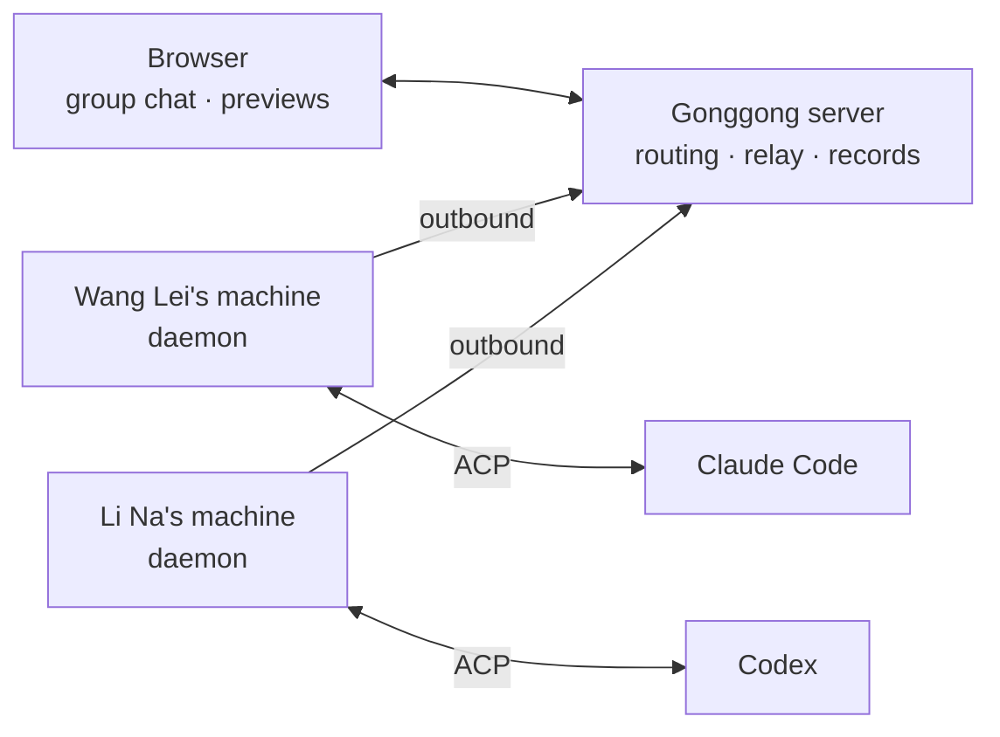

<p align="center"></p>

<h1 align="center">Gonggong Space</h1>

English | [简体中文](README.md)

Documentation: [English](https://yoqu.github.io/gonggong-space/en/) · [中文](https://yoqu.github.io/gonggong-space/)

<p align="center"><b>@ a Bot in your group chat and Claude Code / Codex gets to work on a teammate's machine; open the finished web page right in the group.</b></p>

<p align="center">
  <a href="https://yoqu.github.io/gonggong-space/en/">Docs</a> ·
  <a href="https://yoqu.github.io/gonggong-space/en/guide/quick-start">Quick start</a> ·
  <a href="https://yoqu.github.io/gonggong-space/en/deploy/">Deployment</a> ·
  <a href="https://yoqu.github.io/gonggong-space/en/guide/architecture">Architecture</a>
</p>

<p align="center">
  
  
  
  
</p>


Gonggong Space is a self-hosted AI collaboration platform for small teams. Each member connects their own machine, and the Claude Code / Codex on that machine becomes a **Bot** anyone in the group can @. People and Bots discuss, hand out work, and pass tasks along in the same group, with the process, changes, and results visible to everyone.

## Why we built it

- **Context is scattered across individual terminals**: you had Claude change an API, but your teammate's Codex has no idea. Put it in a group, and even messages that don't @ the Bot are passed to it as context, so everyone shares the same backstory.
- **Machines sit idle on their own**: your workstation has the repo, the dependencies, and a logged-in Agent, but your teammates can't use any of it. Once it's bound, group members can @ your Bot directly and have it work on your machine.
- **Results are invisible**: the Agent says "it's up and running", but the service only listens on `localhost` on its own machine. Gonggong Space tunnels it into the browser so the whole group can open it with a click.

## Highlights

| | |
| --- | --- |
| 💬 **The group chat is the command center**<br>@ whoever you want to start working; follow-up messages can interrupt and add to a run, and `/stop` halts it at any time. A Bot can hand a task off to another Bot in the group. | 🖥️ **Runs on your own machines**<br>The daemon only makes outbound connections, so home NAT and corporate firewalls are no concern. Model calls go straight out from members' machines, never through the server. |
| 🌐 **One-click result previews**<br>Web pages, API services, static reports, desktop app windows, and WeChat mini program simulators can all be opened and operated right in the group, and you can generate time-limited public links. | 🔍 **Transparent process, reviewable changes**<br>Thinking, tool calls, and command output stream back in real time; diffs, Git status, and the file tree are always at hand, and each turn's tokens and context usage are clear at a glance. |
| 🛡️ **Permissions and approvals**<br>Three tiers: Read-only / Workspace write / Full access; only the Bot owner can approve out-of-tier actions; when a Bot is unsure, it asks people in the group with a multiple-choice question. | 🇨🇳 **Works out of the box in China**<br>npmmirror by default; the daemon can install Node, Claude Code, and Codex in one click; built-in presets for major model vendors mean you just pick a vendor and enter a key, and you can import CC Switch configurations. |

<table>
  <tr>
    <td width="50%"><p align="center">Process, changes, and approval records for every turn</p></td>
    <td width="50%"><p align="center">Multiple people and Bots collaborate in one group, with Git status and context usage pinned to the group header</p></td>
  </tr>
  <tr>
    <td width="50%"><p align="center">Out-of-tier actions are approved by the Bot owner</p></td>
    <td width="50%"><p align="center">macOS desktop app: bundled daemon, always in the menu bar</p></td>
  </tr>
</table>

## How it works



- The server only handles accounts, groups, message routing, preview relaying, and auditing. It **holds no repository credentials and never calls models**.
- Each "group × Bot" pair gets its own workspace; once a group is bound to a git repository, the Bot clones it with its owner's own git credentials.
- Agents connect through [ACP (Agent Client Protocol)](https://agentclientprotocol.com), with a pluggable adapter layer that makes it easy to add more Agents.
- A built-in `gonggong` MCP lets Bots search group chat history, look up group members and run records, and ask group members questions.

## How it differs from similar tools

| | Gonggong Space | Board-driven (e.g. Multica) | Team chat SaaS (e.g. Slock) | Personal remote control (e.g. Claude Code Remote Control) |
| --- | --- | --- | --- | --- |
| Collaboration entry point | Group chat; @ to assign work | Issues / boards; assign to dispatch | Channels | Single-user sessions |
| Deployment | Self-hosted | Self-hosted / cloud | Hosted service | Official service |
| Focus | Multiple people sharing the Agents on each other's machines, with results previewed right in the group | Task flow and review | People and Agents living in channels | Taking over your own session from anywhere |

> All of these products are evolving quickly. The table only shows differences in positioning; refer to each product's own docs for its actual capabilities.

## Security notes

Letting others @ your Bot means allowing them to run an Agent on your machine. Gonggong Space enforces these constraints:

- By default, a Bot works in an isolated managed workspace (`~/.gonggong/workspaces/`), and only the Bot owner can change its permission tier and command approvals;
- The trigger scope can be set to "only me / a specific list / any group member";
- The daemon must use HTTPS to connect to a non-local server, with support for certificate fingerprint pinning; every action leaves an audit log.

**Recommendation**: run Bots on a dedicated machine or virtual machine. If you use your everyday workstation, keep it on the "Workspace write" tier and don't open "Full access" to the group. See [Security](https://yoqu.github.io/gonggong-space/en/deploy/security).

## Quick start

**1. Start the services** (Docker)

```bash
git clone https://github.com/yoqu/gonggong-space.git && cd gonggong-space
GONGGONG_ADMIN_PASSWORD=<initial password> docker compose up -d   # open https://localhost
```

For LAN use, certificates and volumes, see [Docker deployment](https://yoqu.github.io/gonggong-space/en/deploy/docker). Without Docker (Node.js 22+, pnpm):

```bash
pnpm install
pnpm db:up                                        # in-repo PostgreSQL (port 54329)
GONGGONG_ADMIN_PASSWORD=初始密码 pnpm dev:server
pnpm dev:web                                      # http://127.0.0.1:5173
```

(`初始密码` is a placeholder for the initial admin password you choose.)

**2. Connect a machine**: download `gg` or the macOS desktop app from [Releases](https://github.com/yoqu/gonggong-space/releases/latest), click 「绑定新机器」 (Bind new machine) in the top-right corner of the web app, copy the command, and run it on the machine that will run the Bot (or paste the connect link into the desktop app):

```bash
gg login --server https://gg.example.com --code K7QM-4X2P
gg run
```

**3. Create a Bot → create a group → `@Bot <your request>`**, and you're done.

For the full steps, see [Quick start](https://yoqu.github.io/gonggong-space/en/guide/quick-start); for production deployment, see [Deploy from source](https://yoqu.github.io/gonggong-space/en/deploy/install).

## Supported platforms

| Item | Support |
| --- | --- |
| Agent | Claude Code, Codex |
| daemon | CLI `gg`: macOS, Linux (glibc 2.31+), Windows; desktop app: macOS |
| Server | Node.js 22+, PostgreSQL 17 |

## Development

| Directory | Description |
| --- | --- |
| `apps/web` | Web client (React + Vite) |
| `apps/server` | Server (Fastify + PostgreSQL) |
| `apps/desktop` | Desktop app (Tauri) |
| `crates/gonggong` | daemon and `gg` CLI (Rust) |
| `crates/gg-cast` | Live view streaming for desktop apps / mini programs |
| `packages/protocol` | All wire contracts (zod) |

```bash
pnpm test && cargo test --workspace   # tests
pnpm typecheck && pnpm lint           # checks
cargo build -p gonggong               # produces target/debug/gg
```

Prerequisites: Node.js 22+, pnpm, PostgreSQL, Rust 1.95+. See [Local development](https://yoqu.github.io/gonggong-space/en/dev/local) and the [Contributing guide](https://yoqu.github.io/gonggong-space/en/dev/contributing).

## Where the name comes from

The name comes from Gonggong (共工), the ancient Chinese water god; in oracle bone script, the character 共 shows two hands lifting an object together. The logo is two wave crests holding up a piece of jade.

## Community

Join the QQ group (1045614717) or add WeChat `yoqu2020`.

<table>
  <tr>
    <td align="center"><br>QQ group: 1045614717</td>
    <td align="center"><br>WeChat: yoqu2020</td>
  </tr>
</table>

## Acknowledgements

Thanks to the [LINUX DO](https://linux.do) community for discussion and feedback.

## License

[Apache-2.0](LICENSE)
