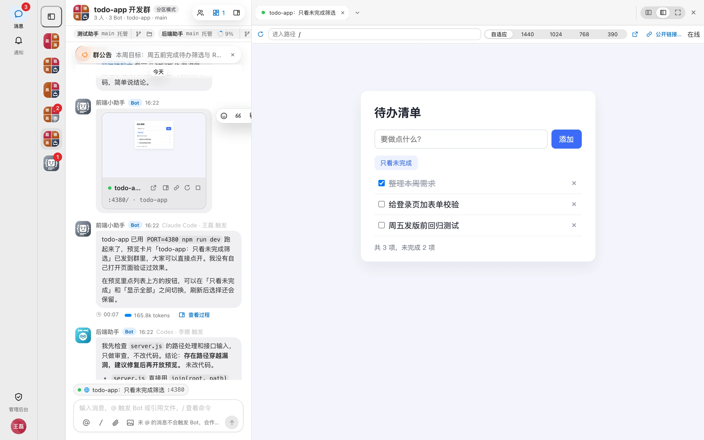
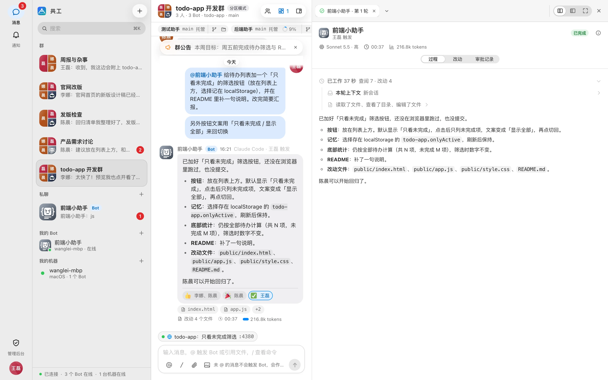
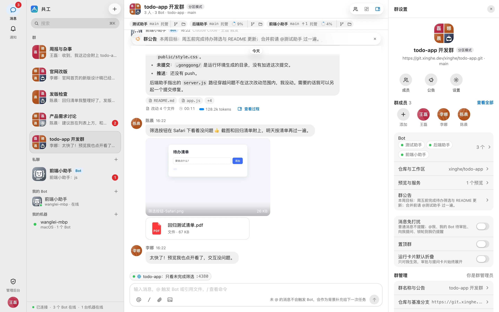
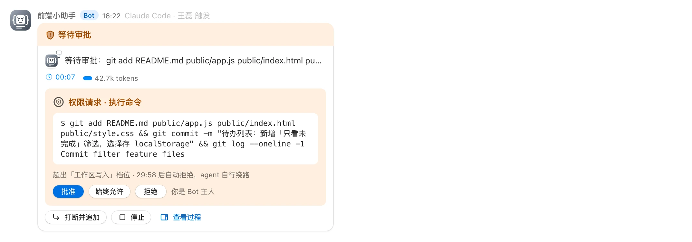
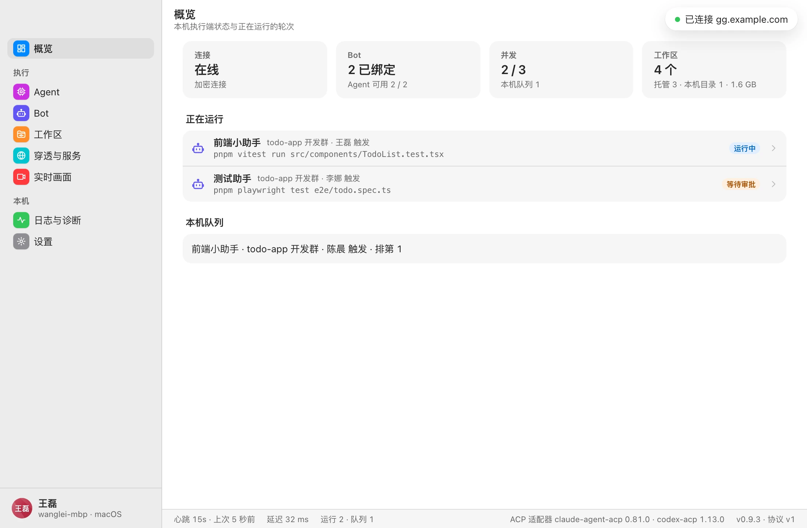
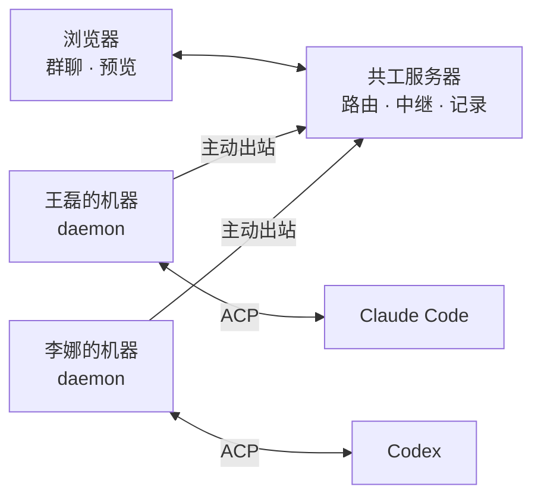
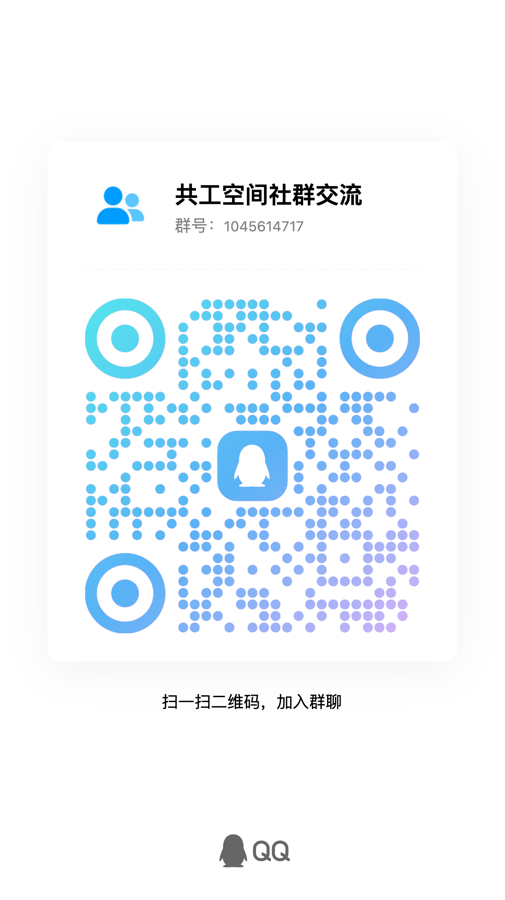

<p align="center"></p>

<h1 align="center">共工空间 Gonggong Space</h1>

[English](README.en.md) | 简体中文

帮助手册：[中文](https://yoqu.github.io/gonggong-space/) · [English](https://yoqu.github.io/gonggong-space/en/)

<p align="center"><b>在群里 @ 一下，队友机器上的 Claude Code / Codex 就开工，做完的网页直接在群里打开。</b></p>

<p align="center">
  <a href="https://yoqu.github.io/gonggong-space/">文档</a> ·
  <a href="https://yoqu.github.io/gonggong-space/guide/quick-start">快速上手</a> ·
  <a href="https://yoqu.github.io/gonggong-space/deploy/">部署</a> ·
  <a href="https://yoqu.github.io/gonggong-space/guide/architecture">架构</a>
</p>

<p align="center">
  
  
  
  
</p>



共工空间是面向小团队的自托管 AI 协作平台。每个成员把自己的机器接进来，机器上的 Claude Code / Codex 就成了群里可以 @ 的 **Bot**。人和 Bot 在同一个群里讨论、派活、接力，过程、改动和结果对全员可见。

## 为什么做它

- **上下文散落在各自终端里**：你让 Claude 改了接口，队友的 Codex 并不知道。放进群里，没 @ 的消息也会作为上下文带给 Bot，大家共享同一份来龙去脉。
- **机器各自闲着**：你的工作机上有仓库、依赖和登录好的 Agent，队友却用不上。绑定后，群成员可以直接 @ 你的 Bot，在你的机器上干活。
- **结果看不见**：Agent 说「已经跑起来了」，可服务只监听在它那台机器的 `localhost`。共工空间把它经隧道送进浏览器，全群点开就能看。

## 亮点

| | |
| --- | --- |
| 💬 **群聊即指挥台**<br>@ 谁谁开工，追加消息可以打断补充，`/stop` 随时叫停。Bot 可以把任务接力给群里另一个 Bot。 | 🖥️ **跑在你自己的机器上**<br>daemon 只向外连接，家里的 NAT、公司的防火墙都不用管。模型调用从成员本机直接发出，不经过服务器。 |
| 🌐 **结果一键预览**<br>网页、接口服务、静态报告、桌面应用窗口、微信小程序模拟器，都能在群里直接打开和操作，还能生成限时公开链接。 | 🔍 **过程透明、改动可审**<br>思考、工具调用、命令输出实时回传；diff、Git 状态、文件树随手查看，每轮的 token 与上下文占用一目了然。 |
| 🛡️ **权限与审批**<br>只读 / 工作区写入 / 完全访问三档；越权操作只有 Bot 主人能批准；Bot 拿不准时会在群里出选择题问人。 | 🇨🇳 **国内开箱即用**<br>默认 npmmirror 镜像；daemon 可一键安装 Node、Claude Code、Codex；内置主流模型厂商预设，选厂商只填 Key，可导入 CC Switch 配置。 |

<table>
  <tr>
    <td width="50%"><p align="center">每一轮的过程、改动与审批记录</p></td>
    <td width="50%"><p align="center">多人多 Bot 同群协作，Git 状态与上下文占用常驻群头部</p></td>
  </tr>
  <tr>
    <td width="50%"><p align="center">越权操作由 Bot 主人批准</p></td>
    <td width="50%"><p align="center">macOS 桌面端：自带 daemon，菜单栏常驻</p></td>
  </tr>
</table>

## 工作原理



- 服务器只负责账号、群、消息路由、预览中继和审计，**不保管仓库凭据，也不调用模型**。
- 每个「群 × Bot」一个独立工作区；群绑定 git 仓库后，Bot 用主人自己的 git 凭据克隆。
- Agent 经 [ACP（Agent Client Protocol）](https://agentclientprotocol.com) 接入，适配层是插件式的，便于扩展更多 Agent。
- 内置 `gonggong` MCP，Bot 可以检索群聊记录、查看群成员与运行记录、向群成员提问。

## 和同类工具的区别

| | 共工空间 | 看板派（如 Multica） | 团队聊天 SaaS（如 Slock） | 个人远程控制（如 Claude Code Remote Control） |
| --- | --- | --- | --- | --- |
| 协作入口 | 群聊，@ 即派活 | Issue / 看板，指派即派活 | 频道 | 单人会话 |
| 部署方式 | 自托管 | 自托管 / 云 | 托管服务 | 官方服务 |
| 侧重 | 多人共用彼此机器上的 Agent，结果在群里直接预览 | 任务流转与评审 | 人与 Agent 常驻频道 | 随时随地接管自己的会话 |

> 各产品都在快速迭代，表中只列定位差异，具体能力以对方文档为准。

## 安全须知

让别人 @ 你的 Bot，就等于允许他在你的机器上执行 Agent。共工空间做了这些约束：

- Bot 默认在隔离的托管工作区（`~/.gonggong/workspaces/`）里干活，权限档位与命令审批只有 Bot 主人能改；
- 触发范围可设为「仅本人 / 指定名单 / 任何群成员」；
- daemon 连接非本机服务器必须走 HTTPS，支持证书指纹固定；所有操作留有审计记录。

**建议**：Bot 跑在专用机器或虚拟机上；如果用日常工作机，保持「工作区写入」档位，不要对群开放「完全访问」。详见 [安全说明](https://yoqu.github.io/gonggong-space/deploy/security)。

## 快速开始

**1. 起服务**（Docker）

```bash
git clone https://github.com/yoqu/gonggong-space.git && cd gonggong-space
GONGGONG_ADMIN_PASSWORD=初始密码 docker compose up -d   # 打开 https://localhost
```

局域网使用、证书与数据卷见 [Docker 部署](https://yoqu.github.io/gonggong-space/deploy/docker)。不用 Docker 时（Node.js 22+、pnpm）：

```bash
pnpm install
pnpm db:up                                        # 项目内 PostgreSQL（端口 54329）
GONGGONG_ADMIN_PASSWORD=初始密码 pnpm dev:server
pnpm dev:web                                      # http://127.0.0.1:5173
```

**2. 接入机器**：从 [Releases](https://github.com/yoqu/gonggong-space/releases/latest) 下载 `gg` 或 macOS 桌面端，网页右上角「绑定新机器」，复制命令在要跑 Bot 的机器上执行（桌面端粘贴接入链接）：

```bash
gg login --server https://gg.example.com --code K7QM-4X2P
gg run
```

**3. 新建 Bot → 建群 → `@Bot 需求`**，完事。

完整步骤见 [快速上手](https://yoqu.github.io/gonggong-space/guide/quick-start)；生产部署见 [从源码部署](https://yoqu.github.io/gonggong-space/deploy/install)。

## 支持范围

| 项 | 支持 |
| --- | --- |
| Agent | Claude Code、Codex |
| daemon | 命令行 `gg`：macOS、Linux（glibc 2.31+）、Windows；桌面端：macOS |
| 服务器 | Node.js 22+、PostgreSQL 17 |

## 参与开发

| 目录 | 说明 |
| --- | --- |
| `apps/web` | Web 客户端（React + Vite） |
| `apps/server` | 服务器（Fastify + PostgreSQL） |
| `apps/desktop` | 桌面端（Tauri） |
| `crates/gonggong` | daemon 与 `gg` 命令行（Rust） |
| `crates/gg-cast` | 桌面应用 / 小程序实时画面推流 |
| `packages/protocol` | 全部线上契约（zod） |

```bash
pnpm test && cargo test --workspace   # 测试
pnpm typecheck && pnpm lint           # 检查
cargo build -p gonggong               # 生成 target/debug/gg
```

前置：Node.js 22+、pnpm、PostgreSQL、Rust 1.95+。详见 [本地开发](https://yoqu.github.io/gonggong-space/dev/local) 与 [贡献指南](https://yoqu.github.io/gonggong-space/dev/contributing)。

## 名字由来

名字取自上古水神共工；「共」字甲骨文是双手合力托举一物。Logo 是两道浪尖托起一枚玉。

## 交流

扫码加入 QQ 群（群号 1045614717），或加微信 `yoqu2020`。

<table>
  <tr>
    <td align="center"><br>QQ 群：1045614717</td>
    <td align="center"><br>微信：yoqu2020</td>
  </tr>
</table>

## 致谢

感谢 [LINUX DO](https://linux.do) 社区的交流与反馈。

## 许可证

[Apache-2.0](LICENSE)
