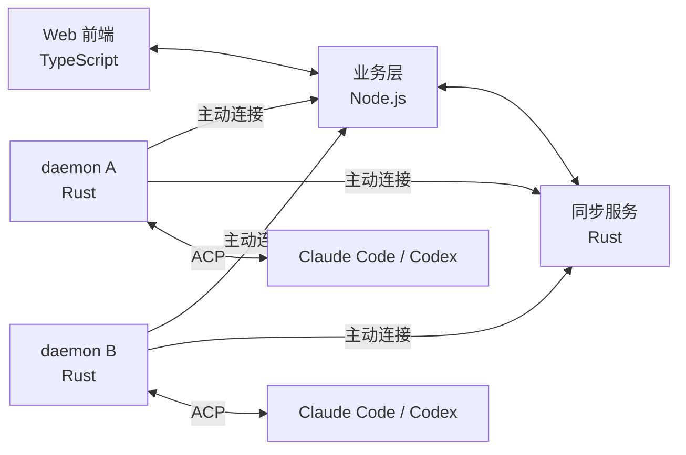
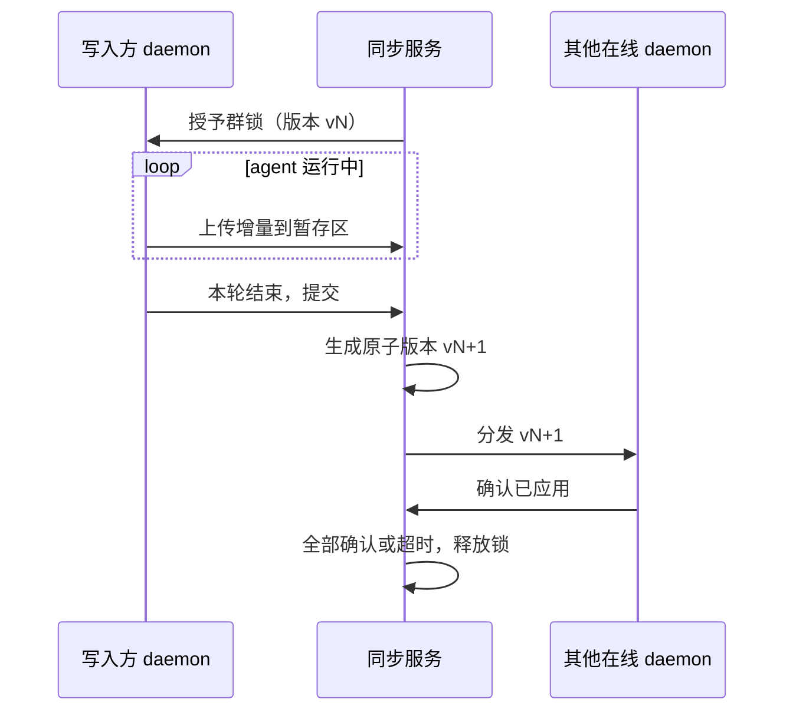

# AI 团队工作区指挥平台 需求规格说明书（v1.0）

Sep 23, 2026 · @Someone

## 1. 概述

本系统是一个面向约 20 人内部团队的 Web 版 AI 工作区指挥平台：人在群聊里 @ 各自本机上的 Claude Code / Codex，让它们在同一个 git 仓库上协作工作。系统只负责路由、工作区、同步和配置下发，任务编排完全交给通过 ACP 接入的 agent。

### 1.1 目标

- 团队成员能在 Web 群聊里指挥任意成员机器上的 agent，并看到它们的运行过程。
- 一个群绑定一个 git 仓库，每个 bot 在自己的独立工作区里工作。
- 支持两种协作模式：分区模式（各自编码，靠 git 交换）和强制同步模式（单写入者 + 全员文件强一致）。
- 管理员统一下发 skill、MCP 等 agent 配置。
- 本机 Rust daemon 作为服务器在成员电脑上的执行端，接受服务器的基础设施指令。

### 1.2 非目标

- 不做任务编排、工作流设计器或多 agent 调度策略。
- 不做「代理执行」：服务器不决定由谁的机器来干活，也不借用他人的 bot。
- 不支持多人同时写同一份文件树（不做 CRDT 或自动合并）。
- 不替代 git 的分支、提交、评审流程；强制同步模式不同步 .git，也不对齐各机器的 git 状态。
- 一期不做权威版本的回滚。
- 一期一个群只绑一个仓库，数据模型预留多仓库扩展。
- 一期不面向外部用户，不做多租户。

### 1.3 术语

| 术语 | 定义 |
| --- | --- |
| daemon | 成员本机运行的 Rust 后台服务，负责连接服务器、启停 agent、管理工作区和同步 |
| bot | 某人某台机器上的一种 agent，如「小王的 Claude」；归属于机器主人 |
| 群 | 多人多 bot 的聊天空间，可绑定一个 git 仓库和一种同步模式 |
| 托管工作区 | daemon 为每个「群 × bot」自动创建的独立目录 |
| 一轮 | 一条消息触发的一次 agent 执行，从开始到最终回复 |
| 群锁 | 强制同步群里的写入权，同一时刻只有一个持有者 |
| 权威副本 | 服务器上保存的强制同步群完整文件树，带单调递增的版本号 |
| 落后 | 机器本地版本低于权威版本的状态；落后机器不能拿锁 |
| 接力链 | bot 在回复中 @ 另一个 bot 形成的连续触发 |

## 2. 总体架构

系统由四部分组成：Web 前端、TypeScript 业务层、Rust 同步服务、成员本机的 Rust daemon。服务器部署在国内公有云，成员分散各地办公。

所有连接均由 daemon 向外发起，服务器从不反连个人电脑。

### 2.1 组件职责

| 组件 | 技术栈 | 职责 |
| --- | --- | --- |
| Web 前端 | TypeScript | 群聊、运行卡片与侧边栏、同步进度与状态栏、管理后台 |
| 业务层 | TypeScript / Node.js | 账号、群、bot、消息路由、权限审批、配置中心、实时推送、审计记录 |
| 同步服务 | Rust | 权威副本、增量计算与分发、版本号、群锁与队列、落后判定 |
| daemon | Rust | 连接服务器、启停 agent（ACP）、托管工作区、git 默认动作、同步收发、配置落地、个人密钥存储 |

### 2.2 架构约束

- **锁状态唯一真源**：群锁和队列只存在于同步服务，业务层只展示和转发指令，不自己维护锁状态。
- **同步代码共享**：同步服务与 daemon 共享同一份 Rust 代码（增量格式、校验、版本规则），避免跨语言实现差异。
- **前后端共享类型**：业务层与前端共用一套 TypeScript 消息类型定义。
- **连接方向**：daemon 只出站连接，适配家带 NAT 和防火墙。
- **模型调用不过服务器**：agent 调用模型 API 从成员本机直接发出。

### 2.3 支持范围

- Agent：Claude Code、Codex。ACP 适配层按插件式设计，后续可扩展。
- 操作系统：macOS、Linux、Windows。

### 2.4 daemon 可接受的服务器指令

服务器对 daemon 的调度限于消息路由和基础设施指令，不决定由谁来干活。

- 消息路由：把群消息送给被 @ 的 bot。
- 工作区：创建、删除、clone、fetch。
- 同步：拉取并应用权威版本、上传暂存增量、回滚。
- 配置：下发 skill、MCP、指令类配置与团队密钥。
- agent 生命周期：启动、停止、会话恢复。
- 网络检测：测量到服务器的延迟与带宽。

* 自身维护：自动升级、token 被吊销后清除团队密钥和托管工作区。

## 3. 身份、bot 与权限

每台机器归属一个人，每个 bot 归属其机器主人，在该机器上执行的一切操作都由主人授权和负责。

### 3.1 账号

- 一期由系统管理员在后台手动创建账号，用账号密码登录 Web 端。
- 认证模块预留 OIDC 接口，二期接入公司 SSO。
- 角色：系统管理员、群管理员、普通成员。

### 3.2 daemon 绑定

1. 成员在 Web 端生成一次性绑定码。
2. 本机执行 daemon 登录命令并输入绑定码。
3. 服务器校验后下发长期 token，该机器归属该成员。
4. daemon 上报机器名、操作系统和本机可用的 agent。

### 3.3 bot 生命周期

- 系统管理员或成员本人都可以在 Web 端新建 bot：选择归属人、agent 种类并命名。成员本人只能为自己创建 bot，管理员可以为任何人创建。创建时可填写一段内置系统提示词，说明该 bot 的作用和用途（如「后端接口开发，只改 server/ 目录」）。该提示词在 bot 所有群的会话开始时注入，并在群成员列表中展示为 bot 简介；归属人和管理员可随时修改，下一次新开会话时生效。优先级位于仓库基线之上、服务器全局层和群层之下。
- 新建时选择归属人已绑定的机器与 agent，直接完成绑定；为他人创建时需机器主人确认后生效；归属人尚无机器时为「待绑定」，绑定首台机器后自动绑定。未绑定或未确认的 bot 不能被触发。
- bot 可被拉入多个群，在每个群里有独立的工作区和会话。
- bot 状态：待绑定 / 待确认、在线空闲、运行中、离线、落后、不参与。

### 3.4 权限审批

- agent 发出的权限请求以可操作卡片形式展示在群里。
- **只有 bot 主人可以批准或拒绝**，其他成员只能查看。
- 主人可为自己的 bot 设默认权限档位：full、workspace、read-only。
- 等待审批超时后自动拒绝该请求，由 agent 自行绕路或收尾。超时时长：分区模式 30 分钟，强制同步模式 5 分钟，群管理员可调。
- 所有审批操作写入审计记录。

### 3.5 仓库凭据

- 服务器只持有一把只读部署密钥，仅用于为强制同步群建立基准。
- daemon 使用主人本机已有的 git 凭据进行 clone、fetch 和 push，凭据不离开本机。
- agent 产生的 commit 归属于 bot 主人的 git 身份。

### 3.6 触发范围

- bot 主人可设置谁能触发自己的 bot：任何群成员（默认）/ 指定名单 / 仅本人。
- 权限档位为 full 的 bot 强制要求触发人在指定名单内。
- 范围外的人 @ 时，卡片显示「无权触发」，不启动运行。
- 接力链和扇出中，每一跳都按链的最初发起人校验触发范围。

### 3.7 用量可见

- 运行卡片显示本轮 token 用量（ACP 适配器能上报时）。
- 管理后台按 bot、触发人、群汇总用量。
- bot 主人能看到谁用了自己的 bot、用了多少。
- 不做配额限制。

## 4. 群、工作区与会话

每个「群 × bot」组合拥有一个独立的工作区和一条持续的 agent 会话。

### 4.1 群

- 群可绑定一个 git 仓库（远端地址 + 基准分支）。一期一群一仓库，数据模型按「群 → 多仓库」设计，二期放开。
- 群有两种同步模式：分区模式（默认）和强制同步模式，可切换，见 6.9。
- 群管理员可拉入或移除 bot，调整群级参数。
- **私聊**是只有自己和自己 bot 的单人群，同样可绑仓库、可选模式，所有规则与群相同。
- **不绑仓库的群**：每个 bot 使用主人绑定的本机目录（可为不同仓库或普通目录），只能用分区模式。
- 移出正在持锁的 bot，按非主动中断处理（见 6.7）。

### 4.2 托管工作区

- bot 可设置一个默认工作区（主人机器上的已有目录）。
- 工作区生效顺序：群内绑定 > 群仓库 > bot 默认工作区 > 未绑定。未绑定的 bot 被 @ 时不执行，只在群里提醒主人绑定。
- bot 加入绑定了仓库的群时：默认工作区的 remote 与群仓库一致则自动绑定；否则由主人在绑定卡片里选择本机目录（remote 必须一致）或托管克隆，托管路径如 `~/.<app>/workspaces/<群 ID>/<bot ID>/<仓库 ID>/`。
- 同一 bot 在不同群里的工作区互相隔离，不共享文件。
- bot 被移出群时保留工作区，由主人决定是否删除。

### 4.3 /cd 逃生口

- bot 主人可用 /cd 将 bot 绑定到本机已有的目录（如带构建缓存的大仓库）。
- 群绑定了仓库时，系统校验该目录的 git remote 与群仓库一致；群未绑定仓库时，接受任意目录，并自动识别是否为 git 仓库。
- 同一目录同一时刻只允许跑一轮，其余排队。
- **只允许在分区模式的群里使用**。群切到强制同步时，非托管工作区的 bot 自动变为「不参与」，改回托管路径后才能加入。

### 4.4 会话管理

- 每个 bot 在每个群里维持一条持续的 ACP 会话，支持 /new 手动开新会话。
- daemon 或机器重启后用 ACP 会话恢复接上原会话。
- 恢复失败时开新会话，并把最近的群消息作为开场上下文（条数不超过「每轮随消息附带的群聊上下文」），更早的由 agent 用内置工具查询。

* 服务器配置变更只对新会话生效；管理员可要求相关 bot 下一轮开新会话，见 7.4。

### 4.5 群聊上下文

- 每次 @ 一个 bot 时，补送它上次被 @ 以来的群消息：人的发言 + 其他 bot 的最终回复。只随消息附带最近 N 条（系统参数，默认 20），其余告知条数，由 agent 按需用内置工具读取。
- 内置 `gonggong` MCP 提供聊天记录读取与检索、群信息与成员、运行记录、提问卡片历史、历史附件下载。可读范围是当前会话加上该 bot 当前所在、未归档的群；私聊只在私聊内可读。跨群读取写入审计。
- 不补送其他 bot 的工具调用过程。
- 强制同步群额外附带版本跨度提示，如「自你上次工作后权威版本从 v12 到了 v17」。
- 分区模式额外附带 git 默认动作的结果，见 5.2。

### 4.6 接力链

- bot 可在回复里 @ 另一个 bot 来触发它。
- 链长上限 3 跳，超出后的 @ 只作为文本显示。
- 每一跳在群里可见，任何成员可用 /stop 终止整条链。
- 强制同步群里接力的排队规则见 6.6。

### 4.7 bot 并发

- 同一个 bot 在不同群里可以并行运行，上限由 bot 主人设置，默认 2。
- 超出上限的请求进入该 bot 的本机队列，群里显示「该 bot 忙，排第 N」。
- **资源获取顺序**：一轮必须先拿到 bot 并发名额，再去排强制同步的群锁，以避免死锁。

### 4.8 bot 离线时被触发

- 出一张「bot 离线、等待上线」卡片，请求进入该 bot 的本机队列。
- bot 上线后自动执行；等待超过 30 分钟则作废，并通知触发人。
- 强制同步群里，离线 bot 不占锁队列位；上线并补齐到权威版本后才进锁队列。

## 5. 分区模式

分区模式下各 bot 在各自工作区里并行工作，文件互不相通，代码只通过 git 的提交、推送、拉取交换。

### 5.1 git 操作归属

- 系统不管理分支、提交和合并，全部由 agent 按人的指令自行操作。
- 团队的分支约定（如每个 bot 一个分支、走 PR）写入仓库或群级的 AGENTS.md，由 agent 遵守。

### 5.2 每轮开始前的默认动作

1. daemon 执行 git fetch。
2. 若工作树干净且当前分支能 fast-forward 到其上游，则自动快进（仅托管工作区；/cd 绑定的本机目录只 fetch 不快进）。
3. 否则不动工作树，把「落后远端 N 个 commit」和是否有未提交改动写入这一轮的上下文告诉 agent。

### 5.3 群内展示

群里为每个 bot 展示其 git 状态，每轮结束后刷新：

- 当前分支
- 落后 / 领先远端的 commit 数
- 是否有未提交改动
- 工作区类型：托管 / /cd 绑定

## 6. 强制同步模式

强制同步模式的铁律：**同一时刻只有一个写入者，其他人必须等待**。任何开始工作的 agent 看到的都是最新的权威版本，所有在线机器的文件在每轮结束后彼此一致。

### 6.1 群锁与一轮的边界

- 默认：一条消息触发的一轮执行就是一次工作，跑完并同步完成后自动释放锁，队列中下一条自动开始。
- /hold：临时升级为连续占用，持锁人可连续发多轮消息，直到 /release 或无操作 15 分钟后自动释放。
- 队列按先来后到排序，接力链例外，见 6.6。
- 落后或「不参与」的机器不能拿锁。

### 6.2 人的手动修改

- 人在本机用 IDE 修改托管工作区，也算一次写入。
- 必须先在群里 /hold 拿到锁，改完 /release 时作为一个版本同步出去。
- 未持锁时的本地修改，在下次同步时被覆盖。覆盖前先备份到本机隐藏目录，并在群里提示。

### 6.3 同步范围

- 只同步工作树，**不同步 .git 目录**。
- 排除 .gitignore 命中的依赖和构建产物，各机器自行安装和构建。
- git 状态由各机器自行维护，系统不做对齐：工作树是唯一真相，git 只是每台机器上的本地工具，提交、推送和分叉处理由人和 agent 决定。
- 每轮上下文告诉 agent 当前权威版本号和本机 git 状态（分支、领先 / 落后远端、未提交改动）。
- daemon 写入的配置和附件目录由各机器的 daemon 自行加入 .git/info/exclude，见 7.2。

### 6.4 传输与权威副本

- 所有数据经服务器中转，不做 P2P。
- 服务器保存完整的权威副本，带单调递增的版本号。
- 落后或新加入的机器直接从服务器补齐。
- 「同步完成」的定义：机器本地版本号 = 权威版本号。

### 6.5 一轮的同步流程

- agent 运行中边跑边上传到服务器暂存区，但不分发。
- 一轮结束后作为一个原子版本整体提交并分发，其他机器永远不会看到改了一半的文件树。
- 只等当前在线的机器。单台机器分发超过 60 秒未确认，标为落后，不阻塞队列。
- 落后机器重连或恢复后自动补齐，补齐前不能拿锁。

### 6.6 接力链的排队

- bot A 在回复里 @ bot B 时，B 这一跳插到队头。
- A 这一轮仍要先完成提交和分发，B 的机器同步到最新版本后才能拿锁。
- 规则：一跳 = 一版本 = 一次同步。

### 6.7 中断处理

| 中断类型 | 暂存修改 | 写入方本机 | 锁 |
| --- | --- | --- | --- |
| 主动 /stop | 发起人选择丢弃或保留；保留则提交为版本并标记「中断」 | 丢弃时回滚到上一版本 | 处理完成后释放 |
| agent 崩溃 | 丢弃 | 半成品移入备份目录，回滚到上一版本 | 立即释放 |
| 写入方断线或超时 | 丢弃 | 重连后半成品移入备份目录，按落后处理先补齐 | 服务器超时后主动释放 |

权限审批超时不算中断：请求被自动拒绝，agent 继续运行并正常收尾，见 3.4。

### 6.8 网络检测

- 群管理员开启强制同步时，测每台在线 daemon 到服务器的延迟和带宽。
- 不达标则拒绝开启，并列出不达标的机器。阈值见第 10 节。
- 开启后不做持续测速，运行中网络变差由 6.5 的超时规则兜底。

### 6.9 模式切换

**分区 → 强制同步**

1. 群管理员指定远端基准分支，并通过网络检测。
2. 服务器用只读部署密钥从该分支建立权威副本 v1。
3. 工作树干净（改动已 commit + push）的 bot 对齐到 v1。
4. 有未推送改动的 bot 或 /cd 绑定的 bot 标为「不参与」，不阻塞切换，处理干净后再加入。

**强制同步 → 分区**

- 直接解除锁，各机器保留当前文件各自独立演进。
- 服务器归档该权威副本。

**切换时的队列**

- 切换请求进入队列末尾，它前面的请求按原模式跑完，轮到它时才执行切换。
- 切换之后进来的请求，等切换完成后按新模式跑。

## 7. 配置中心

配置采用两层叠加：仓库里的配置是项目基线，服务器下发的是团队覆盖层，冲突时服务器优先。整个过程不修改仓库里的任何文件。

### 7.1 配置层级

| 层级 | 维护者 | 内容 | 优先级 |
| --- | --- | --- | --- |
| 仓库基线 | 提交进仓库 | .mcp.json、.claude/、AGENTS.md 等项目级配置 | 低 |
| 服务器全局层 | 系统管理员 | 全团队通用的 MCP、skill、指令 | 中 |
| 服务器群层 | 群管理员 | 特定群的 MCP、skill、指令 | 高 |

### 7.2 落地方式

- 两层合并在 daemon 内存里完成。
- **MCP**：通过 ACP 新建会话时的 MCP 服务器参数注入，不落盘。
- **skill 与指令类**：写入 agent 原生的本地专用文件或新增文件，并由 daemon 把这些路径加进 .git/info/exclude。
- 永不写入用户全局配置目录（如 ~~/.claude、~~/.codex）。
- 效果：工作树保持干净，分区模式的自动快进和模式切换的前提不被破坏；exclude 规则由每台机器的 daemon 自行写入，不随同步传播。

* **系统内置 MCP 工具**：内置 `gonggong`（「向群成员提问」与 4.5 所列的读取工具）始终随 ACP 注入每个会话，不受配置层级影响，见 4.5、8.8。

### 7.3 密钥

密钥一律不得落进工作区文件，否则强制同步会把它广播给全群。

| 密钥类型 | 示例 | 存储 | 注入 |
| --- | --- | --- | --- |
| 团队共用 | 内部知识库、内部 API | 服务器加密存储，按机器加密下发 | daemon 注入 agent 进程环境变量，不落盘 |
| 个人 | 个人 Jira、GitHub token | 仅存在本人 daemon，服务器只知道引用名 | 配置中写 `${secret:NAME}`，由 daemon 替换为实值 |

- 个人密钥缺值时，对应 MCP 在该机器上自动禁用，并在 bot 状态里提示。
- 管理员不可读取个人密钥。

### 7.4 生效时机

- 服务器配置变更只对新会话生效（MCP 在会话创建时注入）。
- 管理员保存配置时可勾选「强制相关 bot 下一轮开新会话」，默认不勾选。
- 运行中的轮次不受影响；因配置变更开新会话的那一轮，卡片上提示。

## 8. 界面与群聊交互

群聊时间线以人的对话为主，每轮 agent 运行只占一张实时更新的卡片，详细过程放进侧边栏。

### 8.1 运行卡片

- 字段：bot 名、触发人、状态、当前步骤、改动文件数、耗时、接力跳数。
- 状态：排队中、等待锁、运行中、等待审批、同步中、已完成、已中断。
- 操作：/stop、权限审批按钮（仅 bot 主人可点）、中断后的丢弃 / 保留选择（仅发起人可点）。
- 强制同步群的卡片上显示本轮同步进度，不单独刷消息。
- 运行结束后，最终回复作为一条普通消息跟在卡片后面。

### 8.2 侧边栏

点开卡片进入侧边栏，查看完整过程：思考内容、每次工具调用、命令输出、文件 diff、权限审批记录。

### 8.3 同步进度

- 总进度条：已同步机器数 / 在线机器数。
- 可展开的逐机器列表：机器主人、机器名、字节进度、状态（完成 / 进行中 / 超时落后）。

### 8.4 群顶部常驻状态栏

- 强制同步群：当前持锁者（含 /hold 剩余时间）、等待队列、权威版本号、落后机器数。
- 分区模式群：各 bot 的 git 状态摘要，见 5.3。

### 8.5 管理后台

- 账号与角色管理。
- bot 新建、绑定 / 确认状态、在线状态。
- 配置中心：全局层与群层的 MCP、skill、指令、团队密钥。
- 各 daemon 的网络质量记录（延迟、带宽），不在群里展示。
- 审计记录查询。

* 用量汇总（按 bot、触发人、群）。
* bot 触发范围与默认权限档位（bot 主人自己设置）。

### 8.6 消息触发规则

- 显式 @ 一个 bot 会触发它。
- 引用回复某个 bot 的消息或运行卡片，等同于 @ 该 bot，被引用的内容一起发送。
- 没有 @ 也没有引用的消息不触发任何 bot，但会在下次 @ 时作为群聊上下文补送，包括其中的附件。
- 不设默认 bot。
- 一条消息 @ 多个 bot 时扇出：每个 bot 各自收到同一条消息、各自出一张运行卡片。
  - 分区群并行执行。
  - 强制同步群按 @ 的顺序依次进入锁队列。
  - 扇出不计入接力链长。

### 8.7 输入框

输入框支持文本、图片和附件，并提供 @ 和 / 两种候选列表。

**@ 候选**

- 一个列表，分「成员 / bot」和「文件」两组显示。
- 文件候选的来源：
  - 强制同步群取服务器上的权威副本。
  - 分区群优先取本条消息已 @ bot 的工作区（含未提交的文件）。没有 @ bot 或该 bot 离线时，回落到远端基准分支的文件树镜像，并标注来源。
  - 服务器用只读部署密钥为每个分区群维护该镜像，只存文件树。
- 引用文件时只发路径（ACP 资源链接），由 agent 在工作区里自行读取；支持引用文件夹。
- 引用的文件只存在于基准分支镜像、不在该 bot 工作区时，附带提示「该文件不在你的工作区，可能需要拉取」。

**/ 候选**

| 分组 | 来源 | 命名规则 |
| --- | --- | --- |
| 系统命令 | 系统内置：/stop、/hold、/release、/new、/cd | 保留名，优先级最高 |
| skill | 已 @ bot 的合并配置（仓库基线 + 全局层 + 群层）；尚未 @ bot 时只显示全局层和群层 | 不得与系统命令重名 |
| agent 命令 | 已 @ bot 通过 ACP 上报的可用命令（如 /compact） | 与系统命令重名时系统命令优先，显示为 /bot名:命令 |

**图片与附件**

- 附件写入工作区内的专用目录 `.<app>/attachments/<消息ID>/`，并加入 .git/info/exclude，工作树保持干净。
- 图片在 agent 声明支持时，额外以 ACP 图片内容直接发送。
- 强制同步群里附件目录随工作区同步，后续拿锁的 bot 也能读到。
- 单个附件上限 50 MB，每条消息最多 10 个附件。

### 8.8 提问卡片

- **机制**：系统内置一个「向群成员提问」的 MCP 工具，通过 ACP 注入每个会话。工具调用阻塞到有人回答或超时。agent 原生提问能力能经 ACP 传出时，也映射成同一种卡片。
- **题型**：单选、多选、自由文本、是/否确认。
  - 一张卡片最多 4 个问题。
  - 选择题可标注一个推荐项，并始终附带「其他，我来补充」输入框。
  - 回答时可附带图片和附件。
- **回答人**：触发这一轮的人和 bot 主人可以回答，其他人只能查看。接力链里的触发人按链的最初发起人计。
- **超时**：时长沿用权限审批设置（分区 30 分钟 / 强制同步 5 分钟）。超时后告诉 agent「无人回答，请按推荐项或最佳判断继续，并在最终回复里列出你做的假设」。
- 卡片记录回答人和回答时间，写入审计记录。

### 8.9 运行中收到新消息

- 默认排队，当前轮结束后作为新的一轮处理。
- 触发人和 bot 主人可执行「打断并追加」：用 ACP 取消当前指令，已改内容保留，立即把新消息发给同一会话继续工作。
- 「打断并追加」仍算同一轮：不释放锁，不走中断处理规则，最后只生成一个版本。

### 8.10 bot 回复渲染

- 按 Markdown 渲染，代码高亮。
- 回复中的文件路径可点击，在侧边栏打开文件内容或本轮 diff。

### 8.11 通知

- 站内通知中心 + 浏览器推送；一期不接邮件和 IM。
- 以下类型只推给有权操作或直接相关的人：待审批（bot 主人）、待回答（触发人和 bot 主人）、锁轮到你（触发人）、bot 离线作废（触发人）、接力链结束（发起人）。
- 群级事件（模式切换、机器落后）只在群里展示，不推送。

## 9. 数据保存与审计

体积小、用于追责和排查的记录永久保存；体积大、可能带出敏感信息的完整运行过程按期清理。

| 数据 | 保存期限 | 用途 |
| --- | --- | --- |
| 群消息（含最终回复） | 永久 | 协作历史、会话恢复的开场上下文 |
| 权限审批记录 | 永久 | 追责 |
| 锁与同步事件 | 永久 | 排查一致性问题 |
| 完整运行过程（工具调用、命令输出、diff） | 30 天，管理员可调 | 侧边栏查看；过期后运行卡片只保留摘要 |
| 权威副本 | 群处于强制同步期间持续保存，切回分区后归档 | 补齐落后机器 |

- 完整运行过程存在服务器上，成员关机时侧边栏仍可打开。
- 备份目录（被覆盖的本地修改、中断的半成品）只存在本机，不上传。

**生命周期事件**

| 事件 | 处理 |
| --- | --- |
| bot 被移出群 | 正在持锁则按非主动中断处理；工作区保留在本机，由主人决定是否删除 |
| 群被删除 | 权威副本和镜像归档 30 天后清除；群消息和审计记录保留 |
| 账号停用 | 立即吊销其所有 daemon token 和 Web 会话；daemon 下次连接失败后清除团队密钥和托管工作区（尽力而非保证）；其 bot 从所有群移除 |

## 10. 默认参数表

以下默认值均可由对应角色调整，标「待定」的需在实测后确定。

| 参数 | 默认值 | 可调整者 |
| --- | --- | --- |
| /hold 无操作自动释放 | 15 分钟 | 群管理员 |
| 权限审批等待（分区模式） | 30 分钟 | 群管理员 |
| 权限审批等待（强制同步） | 5 分钟 | 群管理员 |
| 单台机器分发超时 | 60 秒 | 群管理员 |
| 写入方断线后释放锁 | 待定 | 系统管理员 |
| 接力链长上限 | 3 跳 | 群管理员 |
| bot 并发上限 | 2 | bot 主人 |
| 会话恢复失败时补送群消息数 | 50 条 | 系统管理员 |
| 完整运行过程保留 | 30 天 | 系统管理员 |
| 开启强制同步的网络阈值（延迟 / 带宽） | 待定 | 系统管理员 |
| bot 默认权限档位 | workspace | bot 主人 |
| 单个附件大小上限 | 50 MB | 系统管理员 |
| 每条消息附件数 | 10 个 | 系统管理员 |
| 提问卡片每张题数上限 | 4 | 系统管理员 |
| 提问卡片等待回答 | 沿用权限审批等待时长 | 群管理员 |
| bot 离线时请求等待上线 | 30 分钟 | 群管理员 |
| daemon 心跳间隔 / 离线判定 | 15 秒 / 连续 3 次未收到 | 系统管理员 |
| 服务器备份保留 | 每日一次，保留 7 天 | 系统管理员 |
| 删群后权威副本归档 | 30 天 | 系统管理员 |

## 11. 分期计划

按 P1 → P2 → P3 顺序交付。P2 依赖 P1 的托管工作区、会话和运行卡片，不并行开发。

| 阶段 | 范围 | 完成标志 |
| --- | --- | --- |
| P1 地基 | Web 群聊；账号与绑定码；建 bot 与机器绑定 / 主人确认；daemon + ACP 接入 Claude Code / Codex（三平台）；分区模式（托管工作区、/cd、自动快进、git 状态）；运行卡片与侧边栏；权限审批与超时；会话持续与恢复；bot 并发；接力链；全局 MCP 列表 + ACP 注入；群聊交互（@ 与 / 候选、图片与附件、提问卡片、打断并追加、扇出、引用回复）；私聊与无仓库群；触发范围；用量可见；bot 离线队列；通知中心；安全与运维要求 | 团队可用它替代单人 bridge 日常工作 |
| P2 强制同步 | 权威副本；群锁队列与 /hold；原子版本；中断处理；人的手动修改纳入锁；进度条与常驻状态栏；开启前网络检测；模式切换 | 三平台混合的群可连续运行一周无一致性故障 |
| P3 配置中心 | 两层叠加（全局 + 群）；skill 与指令类下发；.git/info/exclude；团队密钥加密下发；个人密钥引用名 | 管理员改一次配置，全员下一轮生效 |

二期以后的候选项：OIDC / SSO 接入，更多 ACP agent，公用服务器上的 bot，权威版本回滚，一群多仓库，企业微信 / 飞书 / 钉钉通知。

## 12. 风险与待验证项

以下项目需在详细设计阶段实测确认，其中前两项直接影响强制同步在三平台混合环境下的正确性。

| # | 风险 / 待验证项 | 影响 | 拟定应对 |
| --- | --- | --- | --- |
| 1 | 跨平台同步工作树的换行符问题：Windows 开启 core.autocrlf 会产生整文件假 diff | 强制同步 | daemon 在托管工作区统一关闭自动换行转换，以仓库 .gitattributes 为准 |
| 2 | 文件系统差异：macOS / Windows 默认不区分大小写、Windows 路径长度限制、符号链接、可执行权限位 | 强制同步 | 同步服务在上传端检测，拒绝会在其他平台损坏的改动并在运行卡片上提示 |
| 3 | Claude Code 与 Codex 对本地覆盖文件的支持范围，尤其指令类和 skill 类，两者可能不对称 | 配置中心 | 实测后为每种 agent 定义落地映射表 |
| 4 | 两个 agent 的 ACP 适配器对会话恢复和 MCP 注入的实际支持情况 | 会话、配置 | 实测；不支持时会话恢复走 4.4 的兆底路径 |
| 5 | 成员分散办公、家带质量不一，超时→落后可能频繁触发 | 强制同步体验 | P2 上线前用真实网络校准分发超时和开启阈值 |
| 6 | 完整运行过程的命令输出可能带出环境变量或密钥片段 | 安全 | 服务器入库前按已知密钥值和常见 token 格式做脱敏；30 天清理 |
| 7 | 两个 agent 的 ACP 适配器是否支持取消当前指令后在同一会话继续、是否支持图片内容、是否上报可用命令列表 | 群聊交互 | 实测；不支持时对应功能在该 agent 上隐藏或退化（图片只落盘、打断并追加退化为排队） |
| 8 | 分区群基准分支镜像的刷新时机，镜像过旧会让文件候选不准 | 群聊交互 | 打开 @ 候选时触发一次 fetch，候选列表标注镜像更新时间 |
| 9 | token 用量上报依赖 ACP 适配器，两种 agent 可能不一致 | 用量可见 | 实测；不支持的 agent 卡片上显示「未上报」 |
| 10 | 强制同步不对齐 git 状态，多台机器先后提交会产生分叉 | 强制同步 | 每轮上下文告知 agent 本机 git 状态；团队约定强制同步期间由单一机器负责提交，写入群级 AGENTS.md |

## 13. 安全要求

服务器上存有公司代码和命令输出，按内部系统上云的基本要求防护，不做端到端加密。

- 权威副本、基准分支镜像、完整运行过程静态加密存储。
- 服务器只开放 HTTPS 和 WSS。
- daemon 与服务器之间双向验证：daemon 持长期 token，服务器证书固定。
- 运行过程入库前按已知密钥值和常见 token 格式脱敏。
- 团队密钥只以环境变量注入 agent 进程，不落盘；个人密钥不离开本机。
- 管理员的所有操作（建 bot、改配置、改参数、停用账号）写入审计记录。
- 强制同步不同步 .git，因此不存在通过 hooks 向全员机器投递可执行脚本的路径。

## 14. 运维要求

daemon 分布在三种操作系统的约 20 台机器上，升级和兼容性必须自动化。

- **升级**：daemon 自动升级；服务器对外公布协议版本，不兼容的 daemon 被拒绝连接并提示升级。
- **ACP 适配器**：由 daemon 自带并锁定版本，随 daemon 一起升级；Claude Code 和 Codex 本身由成员自己安装和登录；探测到的 agent 版本低于适配器要求时，在 bot 状态里提示。
- **备份**：服务器数据库和权威副本每日备份，保留 7 天。
- **心跳**：daemon 每 15 秒一次，连续 3 次未收到判离线。
- **服务器不可用**：daemon 指数退避重连；运行中的轮次本地继续并缓存输出，重连后补传；强制同步群里该轮结束后的提交等服务器恢复后再执行。
