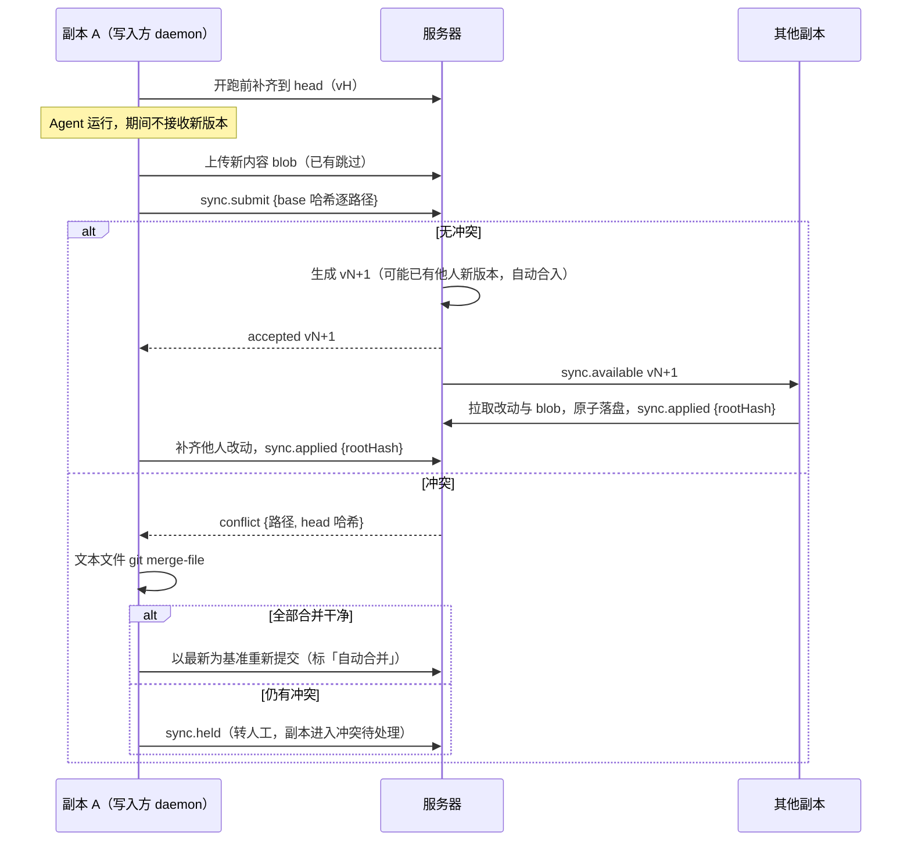

# 强制同步开发计划

目标：绑了仓库的群可切到「强制同步」，群内所有参与的 Bot 工作区文件保持一致；Agent 的改动每轮结束后自动分发到全员；Web/桌面端能看到同步进度，并能确认「全员一致」。

与需求说明书 §6 原稿的最大差异：**不用群锁排队，改为乐观并发**——各 Bot 照常并行运行，提交时由服务器逐文件检查冲突；不冲突自动合入，文本冲突先自动三方合并，仍冲突才由群管理员或 Bot 主人介入。差异汇总见第 7 节，需求说明书已按此修订（S9）。

## 1. 现状

| 项 | 现状 |
| --- | --- |
| 群模式 | `groups.mode` 已有 `'partition' \| 'force'`，界面只读展示；没有切换入口 |
| force 限制 | `/cd` 与本机目录绑定在 force 群被拒（`commands/cd.ts`、`workspaces/routes.ts`）；审批超时固定 5 分钟（`approvals/service.ts`） |
| 每轮改动 | `session.rs::pre_turn` 打 git 快照，`post_turn` 统计改动文件与 patch；每轮前不 fetch、不快进 |
| 中断 | 分区群 /stop 后「保留 / 丢弃」选择（`runs/stop.ts::stoppedDone`） |
| 基础设施 | 静态加密 `lib/seal.ts`；数据目录 `GONGGONG_DATA_DIR`；daemon 测速 `machines/net.ts`（本期不用） |
| 未做 | 同步服务、权威副本、版本、进度与状态栏、切换向导 |

## 2. 决策

| # | 项 | 结论 |
| --- | --- | --- |
| F1 | 名称 | 沿用「强制同步」，值 `force` |
| F2 | 前提 | 群必须绑仓库；参与者必须是托管工作区。本机目录（/cd、默认工作区）的 Bot 为「不参与」 |
| F3 | 同步单元 | **副本** = 群 × Bot 的托管工作区。同一台机器上的两个 Bot 是两份副本，各自同步 |
| F4 | 同步范围 | `git ls-files -co --exclude-standard` 的结果：遵守 .gitignore 与 .git/info/exclude；不含 .git；子模块内容不同步 |
| F5 | 版本 | 服务器为每群维护单调递增版本号；一版 = 一组文件改动（路径、新内容哈希或删除、可执行位）；服务器保存当前完整清单（head） |
| F6 | 并发 | 乐观并发。每条改动带 `baseHash`（该副本开跑时这个文件的哈希）。提交时逐路径比较：head 当前哈希等于 `baseHash` 或等于新哈希即通过，否则冲突。一版整体原子：有一个冲突就整版不入 |
| F7 | 自动合并 | 冲突文件是文本时，提交方 daemon 用 `git merge-file` 做三方合并（base / 我的 / 最新）。合并干净就以最新为基准自动重新提交，版本标「自动合并」；仍有冲突或是二进制文件，才转人工 |
| F8 | 运行中不落盘 | 副本运行期间不接收新版本，结束提交后再一并补齐，避免文件在 Agent 手下变动 |
| F9 | 开跑前补齐 | 每轮开始前副本先补齐到 head；离线或补齐失败照常开跑，卡片标「基于 v12（落后 3 版）」，正确性由 F6 保证 |
| F10 | 接力 | 上一跳提交完成（入版或转人工）后，下一跳才开始；开始前按 F9 补齐 |
| F11 | 人工介入 | 冲突改动挂起，副本进入「冲突待处理」：不接收新版本，该 Bot 在本群的新触发排队。群管理员或该 Bot 主人处理，每个冲突文件选「保留我的 / 采用最新 / 交给 Bot 合并」，也可整版丢弃（先备份） |
| F12 | 本地手改（方案 B） | 空闲副本与已知清单不一致，即为「本地有改动」：暂停接收新版本，提醒 Bot 主人选「提交为一版」（走 F6）或「丢弃」（备份后覆盖）。检测时机：落盘新版本前、每轮开跑前。开跑前检测到时，本轮等待主人处理 |
| F13 | 不做锁 | 取消群锁、队列、/hold、/release；人改文件不需要先拿锁 |
| F14 | 一致性校验 | 副本落盘后上报 rootHash（排序后的「路径、权限位、哈希」整体 sha256），服务器与 head 比对。副本状态：一致 / 同步中 / 落后 / 本地有改动 / 冲突待处理 / 不参与 / 离线 |
| F15 | 传输 | 内容寻址：控制消息走 WS，文件内容走 HTTPS `PUT/GET /api/daemon/sync/:groupId/blobs/:hash`（gzip），服务器上传时校验哈希；已有内容不重传 |
| F16 | 存储 | `<GONGGONG_DATA_DIR>/sync/<groupId>/`，用 `seal.ts` 加密。版本元数据永久保存；文件内容保留 head 引用到的，以及最近 30 天版本引用到的（合并要用 base） |
| F17 | 跨平台 | 字节原样同步；托管工作区设 `core.autocrlf=false`。上传前检查：大小写冲突、Windows 非法名或保留名、路径超过 260、符号链接，有问题就整版挂起并提示 |
| F18 | 体积上限 | 单文件 50 MB，单版 200 MB（系统参数）；超限整版挂起，提示加入 .gitignore |
| F19 | git | .git 不同步，各副本自行维护。每轮上下文告诉 Agent 本机 git 状态；约定由一个 Bot 负责提交（写入群指令） |
| F20 | 上下文 | 每轮附带：「自你上次工作后权威版本 v12→v17，改动文件：…（最多 20 个）」，有冲突时附带冲突说明 |
| F21 | 中断 | /stop：发起人选「保留」即提交为一版（标「中断」），选「丢弃」即回滚到 base（先备份）。Agent 崩溃：改动留在工作区，按 F12 处理。daemon 断线：待提交的改动落本地，重连后照常提交 |
| F22 | 审批超时 | 取消强制同步 5 分钟的特例（原因是持锁，现已无锁），沿用群默认 |
| F23 | 开启检测 | 不做网络测速；网络差的副本靠「落后」状态暴露 |

## 3. 机制

### 3.1 一轮

### 3.2 冲突检查（服务器，逐路径 CAS）

- 修改 / 新增：`head[path] == baseHash`（新增时 base 为空）通过；`head[path] == newHash`（两边改成一样）通过，记为无改动；否则冲突。
- 删除：`head[path] == baseHash` 通过；head 已删除则视为一致；否则冲突。
- 路径与目录互斥：新增 `a/b` 而 head 有文件 `a`（或反之）按冲突处理。
- 通过后在同一事务里写入新版本并更新 head；并发提交由事务串行，后提交的方以新的 head 再检查。

### 3.3 人工介入

- 群里出冲突卡片（「@Bot 的改动与 v15 冲突：3 个文件」），通知 Bot 主人与群管理员；运行卡片显示「冲突待处理」。
- 处理弹窗：冲突文件列表，每个文件显示三方 diff 预览，可选：
  - **保留我的**：用我的内容，以最新为基准；
  - **采用最新**：放弃我对这个文件的改动；
  - **交给 Bot 合并**（仅文本）：daemon 把带冲突标记的文件写入副本，自动发起一轮由该 Bot 解决冲突，结束后照常提交；
  - **整版丢弃**：备份后回滚到 head。
- 全部文件处理完后重新提交；如果又冲突（期间又有人改了），按 F7、F11 再走一遍。

### 3.4 本地改动检测

- daemon 在本机状态目录（不在工作区内）保存每份副本的清单缓存（路径、大小、mtime、哈希），重新算哈希时只算 mtime 或大小变了的文件。
- 只在落盘前和开跑前检测，不做常驻监听。

### 3.5 模式切换

**分区 → 强制同步**（群管理员发起，切换向导）
1. 选一个基准 Bot（在线、托管工作区）。它当前的工作树（含未提交改动）生成 v1，不用服务器去克隆。
2. 其他托管副本：git 工作树干净的对齐到 v1（被覆盖的文件先备份）；有未提交改动的标「不参与」，可选择「丢弃并加入」，或处理干净后再加入；本机目录副本为「不参与」。
3. 向导先列出每份副本会怎样处理，管理员确认后执行。
4. 已在运行的轮次照分区模式跑完，期间的新触发等切换完成后按新模式运行。

**强制同步 → 分区**：停止同步，各副本保留当前文件各自发展；服务器归档权威副本 30 天（需求 §9）。

**中途加入**：新进群的 Bot 或从「不参与」恢复的副本，从服务器补齐 head 后加入。

## 4. 界面（按 Pane 设计系统）

| 位置 | 内容 |
| --- | --- |
| 群顶部常驻状态栏 | `强制同步 · v17 · 4/5 一致`，有异常时追加 `1 冲突`、`1 落后`；点开同步面板 |
| 同步面板（群信息内弹窗） | 副本列表：Bot、机器、版本、状态、最后同步时间、操作（处理冲突、处理本地改动、加入）；版本历史：版本号、作者（Bot 或人）、文件数、时间、标签（自动合并 / 中断 / 本地修改） |
| 运行卡片底部 | `基于 v12 → 提交为 v15（自动合入 v13、v14）· 分发 3/4`；冲突时显示 `冲突 2 个文件 · 处理` |
| 群事件 | 冲突、副本落后、模式切换（`postEvent`，群内展示，冲突另发通知） |
| 群设置 · 同步模式 | 切换入口与向导 |

## 5. 切片（TDD，每片测试全绿 + typecheck + lint）

### S1 协议（已完成）
- `packages/protocol`：`SyncChange {path, op, hash|null, baseHash|null, exec}`；d2s `sync.submit`、`sync.applied`、`sync.held`、`sync.drift`；s2d `sync.result`（accepted / conflict）、`sync.available`、`sync.resolve`、`sync.init`（切换时基准与对齐指令）；Web DTO：`SyncStatusDto`、`SyncReplicaDto`、`SyncVersionDto`、`SyncConflictDto`。
- `RunStart` 增加 `sync {headVersion, behind, changedSince[]}` 供上下文使用；`RunDone` 增加同步结果。
- fixture 与 `protocol.rs`，TS 与 Rust 都要能往返。

### S2 服务端版本库（已完成）
- `schema.ts`：`sync_versions`（群、版本号、作者、来源 run、标签、rootHash）、`sync_changes`（版本 × 路径改动）、`sync_head`（群 × 路径 → 哈希、权限位）、`sync_replicas`（群 × Bot → 版本、状态、rootHash、更新时间）、`sync_conflicts`（挂起的改动集与逐文件处理结果）。执行 `db:generate`。
- blob 存储：上传时校验哈希、加密存储、按 F16 保留。
- `submit` 服务：3.2 的逐路径检查与事务。
- 测试：不重叠的并发提交都入版；同文件冲突；两边改成一样的不冲突；删除与修改冲突；路径与目录互斥；rootHash 与 head 一致。

### S3 daemon 清单与落盘（已完成）
- 清单计算（F4，mtime 缓存）、与 base 求差、跨平台与体积检查（F17、F18）、blob 上传下载、落盘（全部 blob 下完后逐个先写临时文件再改名替换，最后删除已删文件）、rootHash。
- `git merge-file` 三方合并（F7）。
- 测试：表驱动覆盖增删改、可执行位、.gitignore 排除、大小写冲突拒绝、落盘后 rootHash 一致、合并干净与有冲突。

### S4 一轮闭环（已完成）
- 调度：force 群开跑前补齐（F9）；`post_turn` 后提交，运行中暂缓接收新版本（F8）；接力等提交完成（F10）；上下文提示（F20）。
- 服务端分发 `sync.available`，汇总副本状态，推送给 Web。
- 界面：常驻状态栏、运行卡片同步行、同步面板副本列表。
- 测试：两副本先后修改不同文件，最终一致；并发修改同一文本文件的不同位置，自动合并后一致。

### S5 本地改动（方案 B）（已完成）
- `sync.drift` 上报、暂停接收、「提交为一版 / 丢弃」操作与备份；开跑前检测时等待处理。
- 测试：手改后收到新版本时暂停而不覆盖；提交后入版并分发；丢弃后有备份且与 head 一致。

### S6 冲突人工介入（已完成）
- 挂起、冲突卡片与通知、处理弹窗（三方 diff）、四种处理方式、交给 Bot 合并时发起的合并轮、重新提交。
- 权限：只有群管理员与该 Bot 主人可处理。
- 测试：二进制文件冲突只能二选一；处理后入版；处理期间该 Bot 的新触发排队；非授权用户被拒。

### S7 中断与断线（已完成）
- /stop 保留时提交为一版（标「中断」）、丢弃时回滚并备份；崩溃后转本地改动；断线后待提交改动落本地，重连后提交。
- 去掉审批超时的 force 特例（F22）。

### S8 模式切换（已完成）
- 向导（选基准、预览每份副本的处理方式、确认）、`sync.init`、不参与与加入、切回分区与归档、切换期间的触发排队。
- 测试：干净副本对齐 v1；未提交副本标不参与；/cd 副本不参与；切回后各自保留文件。

### S9 端到端与文档（已完成）
- e2e：同机两个 Bot 组成两份副本（真实 server、web、daemon、agent），覆盖 S4、S5、S6 的主路径。
- 修订需求说明书 §4.3、§4.5、§4.6、§4.7、§4.8、§6、§8.3、§8.4、§10、§11（按第 7 节）；更新 `docs/快速开始.md`。

## 6. 风险与待实测

| # | 项 | 应对 |
| --- | --- | --- |
| 1 | 大仓库（数万文件）每轮算清单的耗时 | mtime 缓存；S3 用本仓库与一个十万文件的样例实测 |
| 2 | 高频共享文件（锁文件、i18n 词典）冲突多 | F7 自动合并兜住大部分；锁文件冲突时提示「采用最新后让 Bot 重新安装依赖」 |
| 3 | 自动合并文本干净但语义有误 | 版本标「自动合并」，同步面板可查对应 diff |
| 4 | 落盘不是整树原子：落盘期间，正在运行的开发服务可能读到一半的树 | 先下完全部 blob 再集中替换，把窗口压到毫秒级；接受 |
| 5 | 依赖不同步：`package.json` 变了，其他副本的 node_modules 过期 | F20 上下文里列出依赖清单变更，由 Agent 自行安装 |
| 6 | 生产服务器（腾讯云轻量）带宽和磁盘有限 | 内容寻址去重、gzip、F16 保留策略、F18 上限；上线前实测 |
| 7 | 各副本 git 状态分叉 | F19 约定单一提交者 |

## 7. 与需求说明书的差异（已修订进需求说明书）

| 需求条目 | 原规定 | 本计划 |
| --- | --- | --- |
| §6 铁律、§6.1 | 单写入者、群锁、队列、/hold | 乐观并发，无锁（F6、F13） |
| §6.2 | 人改文件要先 /hold，未持锁的改动被覆盖（先备份） | 检测到本地改动就暂停，由主人选提交或丢弃（F12） |
| §6.5 | 运行中边跑边上传暂存区 | 一轮结束后一次上传（只传新内容） |
| §6.6 | 接力插队头 | 上一跳提交完成后下一跳开始（F10） |
| §6.7 | 按持锁处理中断 | F21 |
| §6.8 | 开启前网络检测 | 不做（F23） |
| §6.9 | 服务器用部署密钥从远端分支建 v1 | 由基准 Bot 的工作树生成 v1 |
| §4.7、§4.8 | 先拿并发名额再排群锁；离线不占锁队列位 | 无群锁，这两条删除 |
| §8.4 | 状态栏显示持锁者与队列 | 显示版本、一致数、冲突数、落后数 |
| §10 | /hold 自动释放、强制同步审批 5 分钟、写入方断线释放锁、网络阈值 | 删除；新增单文件 / 单版体积上限 |

## 8. 实现备注

实现中确定、与上文不同或上文未写明的做法：

| # | 项 | 做法 |
| --- | --- | --- |
| 1 | 版本号 | 切回分区再重新开启时，基准 Bot 的整树作为新的一版提交，版本号接续之前的（不从 v1 重来） |
| 2 | 离线托管副本 | 切换时离线或工作区未就绪的托管 Bot 不标「不参与」，向导显示「对齐（上线后 / 就绪后对齐）」，重连或就绪后自动对齐 |
| 3 | run.done 结果 | `RunSyncDone` 除 accepted / unchanged / held / error 外增加 `waiting`（开跑前发现本地改动或冲突待处理：run 回到队列，恢复上下文游标）与 `stopped`（/stop 后改动待保留或丢弃） |
| 4 | 合并轮 | 「交给 Bot 合并」以决策人名义发一条 @ 消息触发（不受触发范围限制），决策随 `RunStart.sync.resolve` 下发；daemon 开跑前写入冲突标记，结束后以 kind `merge` 提交。合并轮被中断或失败：冲突保持原样，冲突文件回到挂起时我的一侧，该轮改过的其他文件先备份再还原；重选时从挂起的原始内容合并，不用残留标记 |
| 5 | 旧版 daemon | Hello 声明 `sync` 能力才参与；旧版 daemon 上的 Bot 为「不参与（daemon 版本过旧）」，不阻塞切换 |
| 6 | 符号链接 | 一期拒绝：含符号链接的改动整版挂起（仓库里有符号链接则无法同步） |
| 7 | 体积上限 | 单文件 50 MB、单版 200 MB 为协议常量（`SYNC_FILE_MAX_BYTES` / `SYNC_VERSION_MAX_BYTES`），未做成系统参数 |
| 8 | /stop 的选择 | 运行卡片「保留 / 丢弃」与同步面板「提交 / 丢弃本地改动」等价：面板处理时同时关闭该轮的待选项（提交 = 保留，丢弃 = 丢弃），下一轮不会把它记成保留 |
| 9 | 断线重发 | 待提交改动存 `pending.json`，按同一 `submitId` 重发，服务器幂等返回已入的版本 |
| 10 | 落后判定 | 新版本发出 60 秒内未一致为「同步中」，之后为「落后」；运行卡片只显示提交结果，落后版本数只在上下文提示里给 Agent |
| 11 | 附件与 .git/info/exclude | 附件目录在 exclude 中，不随同步分发 |
| 12 | /hold、/release | 命令已移除（F13） |
| 13 | 其他 | 强制同步群禁止更换仓库；删除 Bot 或移出群即离开同步；切回分区后归档数据 30 天清理；超前于 head 的 base 版本被拒（`bad_base`） |
| 14 | 密钥文件防护 | 提交前检查（含 init）拒绝未被 git 跟踪（`ls-files` 标 `?`）且文件名像密钥的新增 / 修改文件，按其他违规流程整版挂起（sync.state error + RunSyncDone error）；已跟踪文件不拦。名单见需求 6.6 |
| 15 | 失败原因多语言 | `sync.state` / `RunSyncDone` error / `SyncReplicaDto` 在 `reason` 旁带 `reasonI18n`（中文模板 + 参数），web 按查看者语言渲染（英文在 `protocolEn`）；`reason` 保留给旧客户端，旧 daemon 只有 `reason` 时原样显示 |

e2e：`e2e/force-sync.spec.ts`（同机两个 Bot、mock agent）覆盖切换、分发、并发改不同文件、同行冲突「采用最新」、本地改动从面板提交、切回分区。
