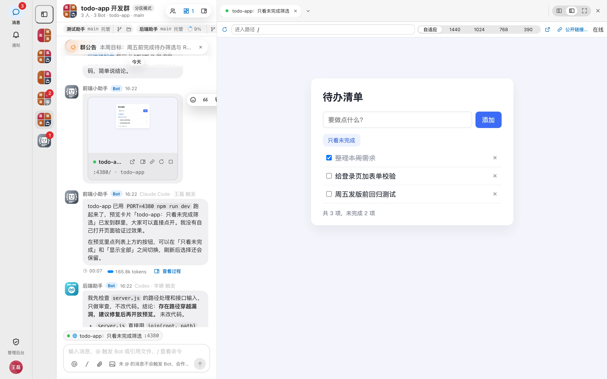
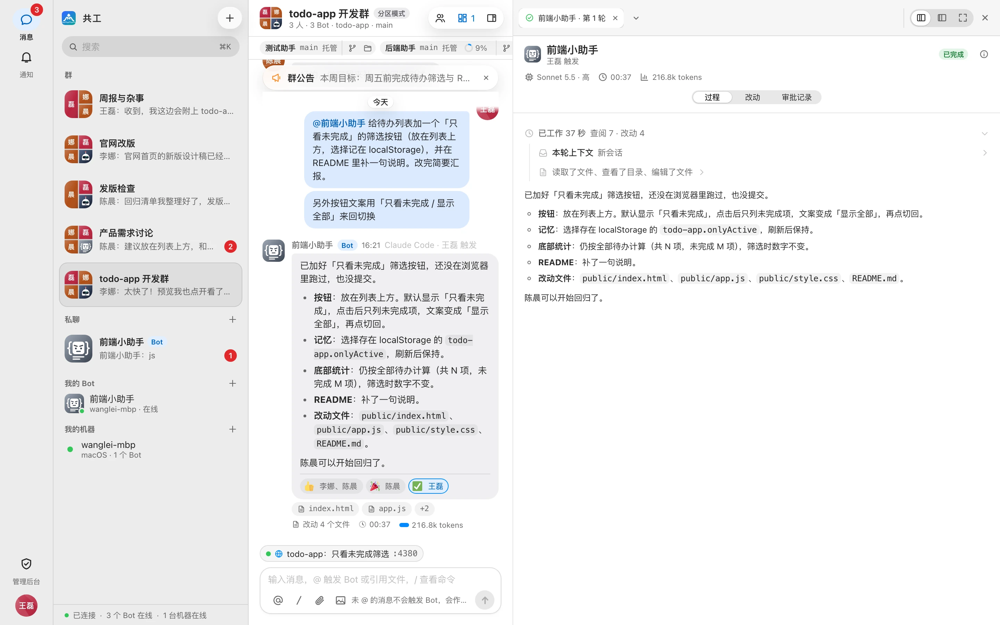
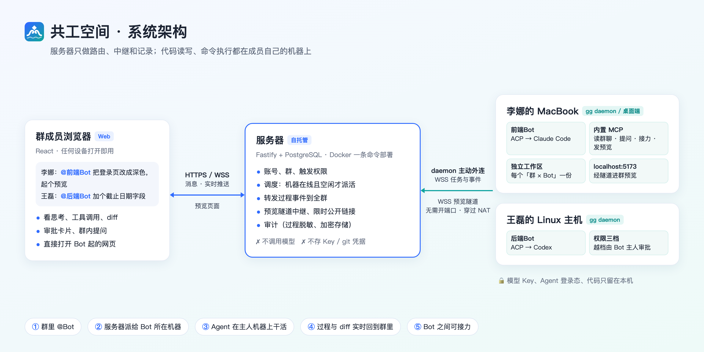
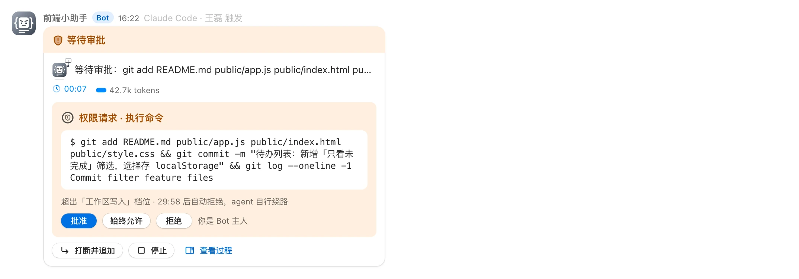

# 共工空间 推广文案 v5（v0.3.0）

链接：仓库 https://github.com/yoqu/gonggong-space · 文档 https://yoqu.github.io/gonggong-space/ · 演示环境 http://gg.uyoqu.com · 下载 https://github.com/yoqu/gonggong-space/releases/latest
配图：`docs/promo/images/`；外链用 jsDelivr 固定到标签：`https://cdn.jsdelivr.net/gh/yoqu/gonggong-space@v0.3.0/docs/promo/images/<名>.png`
视频：`videos/gonggong-promo/renders/gonggong-promo.mp4`（60 秒）、讲解片 3 分 56 秒（文档「视频介绍」页）

## 规范要点

- 链接只放文末，标题不夸张；开源推广可保留社群入口
- 掘金 / 知乎 / CSDN / 思否 / 开源中国 / 公众号：文末带 AI 辅助声明，发文时勾选平台声明
- Hacker News、Dev.to 明令禁止 AI 写的文字：稿子按你口吻起草，**你本人改一遍、自己发**
- r/selfhosted：项目不满 3 个月，只在每周 New Project Megathread 里评论
- 同一平台不重复发；后续版本只发「更新资讯」类帖子

## 平台进度

| 平台 | 节 | 状态 |
| --- | --- | --- |
| LINUX DO | — | ✅ 已发 |
| V2EX 分享创造 | — | ✅ 已发 |
| 掘金 / 思否 / CSDN / 开源中国博客 | A | 全部 ✅ 10-07（思否、CSDN 审核中） |
| 知乎专栏 | A2 | ✅ zhuanlan.zhihu.com/p/2091202037044221441 |
| 微信公众号 | A3 | ✅ 长文 `公众号长文.md` |
| 即刻 / X 中文 | C | 即刻 ✅；X 中文待发 |
| B 站 / 视频号 / 抖音 | C2 | 待发（新增，发宣传片 + 讲解片） |
| HelloGitHub | D1 | ✅ #3881 |
| 阮一峰周刊 | D2 | ✅ #12128 |
| 开源中国软件收录 | D3 | ✅ 已投递，待审核 |
| ACP 官方 Clients 页 | D4 | ✅ PR #2321 |
| awesome-claude-code / awesome-codex-cli | D5 | 待提交（新增） |
| Hacker News Show HN | E1 | 你本人发 |
| Reddit r/ClaudeAI · r/SideProject · r/selfhosted | E2 | 待发 |
| X 英文 | E3 | 待发 |
| Dev.to | E4 | 你本人发 |
| Product Hunt、小红书 | — | 暂缓 |

建议节奏：第 1 天 掘金 + 开源中国 + HelloGitHub + 阮一峰 + ACP PR；第 2 天 思否 + CSDN + 知乎 + 公众号 + 即刻；第 3 天 B 站 + Reddit + X；HN / Dev.to 你本人错开日期。

---

## 核心功能清单（各平台从这里取材）

一句话：**在群里 @ 一下，队友机器上的 Claude Code / Codex 就开工，做完的网页直接在群里打开。**

| # | 功能 | 卖点 |
| --- | --- | --- |
| 1 | 群聊即指挥台 | @ 谁谁开工；运行中追加消息可打断补充，`/stop` 叫停；没 @ 的群消息作为上下文带给 Bot；支持附件、引用、Agent 自带的斜杠命令 |
| 2 | 共用彼此机器上的 Agent | 仓库、依赖、登录态都在主人机器上，队友 @ 就能用；daemon（Rust）只往外连，不用内网穿透；模型 Key、git 凭据只留本机 |
| 3 | Bot 接力与提问 | Bot 可把任务交给群里另一个 Bot（后端改完交前端）；拿不准时在群里出选择题问人 |
| 4 | 过程透明 | 思考、工具调用、命令输出实时回传；diff、Git 状态、文件树随手查；每轮 token 与上下文占用 |
| 5 | 结果预览 | 网页 / 接口 / 静态报告 / **桌面应用窗口** / **微信小程序模拟器**都能在群里打开；桌面与小程序是实时画面，群成员可请求远程操控；可生成限时公开链接 |
| 6 | 强制同步 | 不同机器上的 Bot 共用一份工作区：乐观并发、逐路径提交、冲突自动三方合并，合不了交人逐文件处理；10 万文件仓库跨机验证过 |
| 7 | 定时任务 | 群和私聊可挂定时任务，到点 @ 最合适的 Bot；Agent 也能自己创建 |
| 8 | 权限与审批 | 只读 / 工作区可写 / 完全访问三档；越档操作只有 Bot 主人能批；触发范围可设仅本人 / 名单 / 全员；全程审计 |
| 9 | 团队 | 多团队切换，Bot 归团队、机器归个人；单团队模式后台可配 |
| 10 | 飞书联动 | 扫码一键建应用、飞书登录、群绑定；运行卡片流式打字上屏、预览卡片同步到飞书 |
| 11 | 客户端 | `gg` 命令行（macOS / Linux / Windows）；macOS（签名公证）与 Windows 桌面端，内置 daemon、托盘、自动更新；绑定即用，http / 自签证书都能连 |
| 12 | 国内开箱即用 | 默认 npmmirror，一键装 Node、Claude Code、Codex；内置主流模型厂商预设，选厂商只填 Key；可导入 CC Switch 配置 |
| 13 | 部署与体验 | 服务端 Docker 一条命令；不想部署直接去演示环境 http://gg.uyoqu.com 注册；中英文界面 |

配图对应：群聊主界面 `interface.png`（1、4）· 架构 `architecture.png`（2）· 预览工作台 `preview-workbench.png`（5）· 过程面板 `process-panel.png`（4）· 审批 `approval.png`（8）· 桌面端 `desktop-overview.png`（11）。小程序 / 桌面实时画面可用文档站 `website/public/screenshots/web/workbench-miniprogram.webp`、`workbench-live.webp`。

---

## 口吻要求

参考你在 V2EX 发的帖子：先讲起因和真实场景，再讲功能；口语一点，少用「赋能」「一站式」这类词；坦白现在的不足；结尾邀请吐槽。下面的中文稿都按这个写，发前再按你的习惯顺一遍。

可反复用的真实场景（都来自你的帖子）：

- 国庆家里蹲，肝出了初版
- 团队都在用 Claude Code / Codex，但各用各的：我让 Agent 改了接口队友不知道，我配好的环境队友用不上，Agent 起的服务只在我本机 localhost
- 产品经理提的需求，直接让他 @ 我的电脑改，我只管最后的代码审批，不用再给 AI 转述一遍
- 大厂都在做云端 Agent，我们想做个「类云电脑」：把闲置电脑、同事电脑都组队，群控起来

---

## A. 技术长文（掘金 / 思否 / CSDN / 开源中国博客）

掘金分类「人工智能」，标签 AI编程 / Claude / 开源；CSDN、开源中国勾原创；思否开头不放链接。

**标题**：国庆没出门，做了个能 @ 队友电脑上 Claude Code 的群聊

**正文**：

国庆基本是家里蹲，这几天把一个憋了挺久的东西肝出来了，叫共工空间。先说为什么要做它。

我们团队现在写代码基本离不开 Claude Code 和 Codex，但都是各用各的，用久了很别扭：

- 我让 Agent 改了个接口，队友那边的 Codex 完全不知道，还得我去群里喊一声
- 我机器上仓库、依赖、登录态全配好了，队友想让它跑点东西，只能来找我，或者自己再配一遍
- Agent 说「服务已经起来了」，可它只在我本机 localhost，别人根本打不开

还有一个更痛的：产品经理提了需求，我得先理解一遍，再原样转述给 AI。这一步其实挺浪费时间的。

看到大厂都在做云端 Agent，我就想，我们也可以做个「类云电脑」的东西：把团队里每个人的电脑、甚至闲置的电脑都组个队，大家在一个群里沟通，Agent 也拉进来。谁要干活就 @ 谁的电脑，上下文天然对齐，环境也不用重复配。产品经理的需求可以直接 @ 我的电脑去改，我只管最后的代码和需求审批。



### 用起来是什么样

每个人把自己的机器接进来，机器上的 Claude Code / Codex 就变成群里一个能 @ 的 Bot。

**@ 一下就开工**。跑的过程中可以随时追加消息改方向，`/stop` 直接叫停。没 @ 的群消息也会当作背景带给 Bot，前面聊过的需求不用再复述一遍。

**Bot 之间能接力，拿不准会问人**。后端 Bot 改完接口，可以把活甩给前端 Bot 接着改页面。遇到拿不准的地方，它会在群里出一道选择题，谁答都行。

**过程全群都看得到**。思考、调了什么工具、跑了什么命令，实时往群里推；diff、Git 状态、文件树随手点开看；这一轮花了多少 token、上下文还剩多少，也一眼能看到。



**做出来的东西直接在群里打开**。Bot 起的网页、接口、静态报告，点卡片就在右边打开。不只是网页：Electron / Tauri 这种桌面应用的窗口、微信开发者工具里的小程序模拟器，也能实时推到群里，别人还能申请远程点一点。要给外面的人看，生成个限时链接就行。

**几台电脑共用一份代码**。默认每个 Bot 在自己的工作区里干活，互不干扰。如果想让几台机器上的 Bot 改同一份代码，可以把群切成「强制同步」：谁改了就提交，冲突自动三方合并，实在合不了再交给人一个个文件处理。我拿 10 万文件的仓库在两台机器之间测过。

**定时任务**。比如每天早上让 Bot 跑一遍回归、汇总一下昨天的提交，到点它自己 @ 最合适的 Bot 去干。

**飞书**。也接了飞书应用：扫码建个应用，在飞书群里一样能 @ Bot 干活，运行过程会像打字一样一点点刷出来，配置都在网页后台里弄。

### 怎么搭的



```text
浏览器 Web（React）
   │  HTTPS /api · WSS /ws/web
   ▼
服务器（Fastify + PostgreSQL）
   │  WSS /ws/daemon（任务与事件）· WSS /ws/daemon/tunnel（预览隧道）
   ▼
成员机器上的 daemon（Rust，命令叫 gg；桌面端里自带）
   ├─ ACP 适配器 → Claude Code / Codex（本机已登录的 CLI）
   ├─ 内置 MCP（gonggong）
   └─ 工作区 ~/.gonggong/workspaces/
```

几个我比较在意的设计：

**daemon 只往外连**。成员机器不开端口，家里的 NAT、公司的防火墙都不用管，也不用折腾内网穿透。

**服务器不碰 Key 和代码**。它只管账号、转发消息、派活、中继和审计。代码读写、命令执行都在成员自己电脑上，模型 Key、Agent 登录态、git 凭据也只留在本机。服务器能看到的只有回传的过程、回复和 diff，入库前会脱敏、加密。

**用 ACP，不去解析终端输出**。一开始也想过直接包 CLI 解析输出，但太脆了，CLI 一升级可能就挂。后来换成 [ACP（Agent Client Protocol）](https://agentclientprotocol.com)，思考、工具调用、权限请求都是结构化事件，以后要接别的 Agent，加个适配器就行。每个「群 × Bot」一个会话、一个独立工作区，空闲 10 分钟回收，下次恢复会话，Bot 还记得之前聊过啥。

**群协作能力都走一个 MCP**。daemon 给每个会话起一个 `gonggong` MCP，Agent 通过它翻群聊记录、查成员、在群里提问、发预览、把活交给别的 Bot、建定时任务。

**预览怎么进群**。网页类走隧道：浏览器 → 服务器 → daemon 维持的长连接 → 成员机器的本地端口，HTTP 和 WebSocket 都通。桌面应用和小程序是另一条路：只抓那一个应用的窗口推流，有人在看才推，不会把整个屏幕推出去。

### 安全这块

让别人 @ 你的 Bot，说白了就是让别人在你电脑上跑 Agent，所以这块我做得比较保守：

- 权限分三档：只读、工作区可写、完全访问。越档的操作会弹审批卡片，只有 Bot 主人能批
- 谁能 @ 也能设：只有自己、指定的人、或者群里所有人
- 默认在隔离的工作区里干活，所有操作都有审计
- 对外的预览链接有有效期，随时能收回



我自己的建议还是拿一台专用机器或者虚拟机跑 Bot，日常工作机别对群开「完全访问」。

### 国内用起来

默认走 npmmirror，Node、Claude Code、Codex 都能一键装；常见的模型厂商都内置了，选一下填个 Key 就能用，用 CC Switch 的话可以直接导入配置。

### 想试试的话

不想部署，可以先去演示环境注册玩玩：http://gg.uyoqu.com

自己部署的话，服务端 Docker 一条命令：

```bash
git clone https://github.com/yoqu/gonggong-space.git && cd gonggong-space
GONGGONG_ADMIN_PASSWORD=初始密码 docker compose up -d
```

打开 https://localhost 登录，右上角「绑定新机器」复制命令，到要跑 Bot 的电脑上执行。`gg` 命令行和 macOS / Windows 桌面端都在 Releases 里。然后建个 Bot、拉个群、@ 它干活。

### 现在的状态

现在是 v0.3.0，从国庆前到现在发了三个版本，肯定还有不少毛病。目前只支持 Claude Code 和 Codex，它也不是一个通用的团队 IM，定位就是「几个人一起用 Agent 干活」。

会一直维护下去。最想听听大家团队里会不会这么用、卡在哪，欢迎提 Issue，也欢迎直接吐槽。

- 源码：https://github.com/yoqu/gonggong-space
- 文档：https://yoqu.github.io/gonggong-space/

> 本文部分内容由 AI 辅助创作。

---

## A2. 知乎专栏

**标题**：团队里每个人都在用 Claude Code，怎么让大家共用各自的 Agent？

**正文**：A 从开头到「安全这块」，删掉「国内用起来」「想试试的话」，「现在的状态」只留最后一段，文末改成：

> 项目源码：https://github.com/yoqu/gonggong-space ，架构说明：https://yoqu.github.io/gonggong-space/guide/architecture
>
> 本文部分内容由 AI 辅助创作。

## A3. 微信公众号

用 gzh 排版，正文取 A 的开头（到「产品经理的需求可以直接 @ 我的电脑去改」）+「用起来是什么样」+「想试试的话」+「现在的状态」，开头放 60 秒宣传片。公众号外链不能点，链接写成文字，文末「阅读原文」指向仓库。

**标题**：产品经理提的需求，我让他直接 @ 我的电脑改

---

## C. 即刻 / X 中文

圈子：#独立开发的日常、JitHub程序员。配 60 秒宣传片。

国庆家里蹲，肝了个开源项目：共工空间。

起因是团队都在用 Claude Code / Codex，但各用各的。现在把大家电脑上的 Agent 都拉进一个群，@ 谁谁的电脑开工，Bot 之间还能接力。起好的网页、桌面应用、小程序模拟器直接在群里打开，还能远程点。

最爽的是产品经理提需求可以直接 @ 我的电脑改，我只管最后审批。

自托管，Key 和代码都留在自己电脑上。不想部署可以去 gg.uyoqu.com 注册玩。

github.com/yoqu/gonggong-space

#独立开发的日常

## C2. B 站 / 视频号 / 抖音

- 宣传片（60 秒）：标题「产品经理 @ 一下，我电脑上的 AI 就开工了」
- 讲解片（3 分 56 秒）：标题「国庆肝的开源项目：把团队的 Claude Code 拉进一个群」
- 简介：两三句起因 + 功能清单 1、5、6、7 各一句 + 仓库与演示环境链接；B 站分区「科技 → 软件应用」，标签 Claude Code / Codex / AI编程 / 开源

---

## D1. HelloGitHub（Issue 表单 submit-cn）

- 项目地址：`https://github.com/yoqu/gonggong-space`
- 类别：`人工智能`
- 项目标题：`在群里 @ 一下，队友电脑上的 Claude Code / Codex 就开工`
- 项目描述：`团队里每个人都在用 Claude Code / Codex，但都关在各自的终端里：改了接口队友不知道，配好的环境别人用不上，起好的服务只在本机 localhost。共工空间是一个自托管的群聊，每个人把电脑接进来，电脑上的 Agent 就成了群里能 @ 的 Bot，@ 谁谁的电脑开工，过程、diff、审批全群可见，起好的网页、桌面应用、小程序模拟器直接在群里打开。服务端 Docker 一条命令部署，本机 daemon 用 Rust 写，只往外连，不经手模型 Key。`
- 亮点：
  ```
  - 共用彼此电脑上的 Agent：仓库、依赖、登录态都在主人电脑上，队友 @ 一下就能用，没 @ 的群消息也会带给 Bot
  - 做出来的东西直接在群里看：网页经隧道打开，桌面窗口和小程序模拟器实时推流还能远程操作，可生成限时公开链接
  - 几台电脑能共用一份代码，冲突自动三方合并；还能挂定时任务
  - 权限分三档，越档操作只有 Bot 主人能批，全程审计
  - 国内友好：默认 npmmirror，一键装 Node、Claude Code、Codex，可导入 CC Switch 配置
  ```
- 示例代码：
  ```bash
  GONGGONG_ADMIN_PASSWORD=初始密码 docker compose up -d   # 起服务端（或直接用演示环境 http://gg.uyoqu.com）
  gg login --server https://gg.example.com --code K7QM-4X2P   # 接入电脑
  gg run
  # 然后在群里：@前端Bot 把登录页改成深色并起个预览
  ```
- 截图：`https://cdn.jsdelivr.net/gh/yoqu/gonggong-space@v0.3.0/docs/promo/images/preview-workbench.png`

## D2. 阮一峰周刊（ruanyf/weekly 提 Issue，周一至周三）

**标题**：【开源自荐】共工空间：在群里 @ 队友电脑上的 Claude Code / Codex

```markdown
## 共工空间：多人共用各自电脑上的 AI 编程 Agent

项目自荐。我们团队每个人都在自己的终端里跑 Claude Code 或 Codex，上下文各管各的，Agent 起的服务也只有本机能看到。产品经理的需求还得我先理解一遍，再转述给 AI。

所以做了共工空间，一个自托管的群聊：每个人把电脑接进来，电脑上的 Agent 就成了群里能 @ 的 Bot。@ 谁，谁的电脑就开工；过程、diff、审批全群可见，Bot 起的网页、桌面应用、小程序模拟器在群里直接打开。产品经理也可以直接 @ Bot 提需求，开发只管最后审批。

- 服务器只做转发、中继和记录，不保管仓库凭据，也不调用模型
- 本机 daemon 用 Rust 写，只往外连，不用管 NAT 和防火墙
- Bot 之间可以接力；几台电脑能共用一份代码，冲突自动合并
- 权限分三档，越档操作只有 Bot 主人能批
- 服务端 Docker 一条命令部署，也有在线演示环境

Apache-2.0，客户端支持 macOS / Linux / Windows。

源码：https://github.com/yoqu/gonggong-space
文档：https://yoqu.github.io/gonggong-space/


```

## D3. 开源中国软件收录

- 软件名称：`共工空间 Gonggong Space`；协议：`Apache-2.0`（默认 GPL 需手动改）
- 语言：`TypeScript、Rust`；系统：`跨平台`
- 官网：`https://yoqu.github.io/gonggong-space/`；源码：仓库地址
- 软件介绍：A 的正文（含代码与截图）
- 收录后投「软件更新资讯」：`共工空间 v0.3.0 发布：Windows 桌面端、绑定即用、在线演示环境`

## D4. ACP 官方 Clients 页（PR 修改 docs/get-started/clients.mdx，Messaging 分区）

```
- [Gonggong Space](https://github.com/yoqu/gonggong-space) — self-hosted group chat where teammates @ each other's Claude Code / Codex agents running on their own machines over ACP, with in-chat previews of the web apps, desktop windows and WeChat mini-programs they start
```

## D5. awesome-claude-code / awesome-codex-cli

awesome-claude-code 走仓库的资源提交表单（你本人填）；awesome-codex-cli 有 star 后提 PR。条目：

```
Gonggong Space — Self-hosted group chat where your team @-mentions Claude Code / Codex agents running on each other's machines. Live process and diffs, owner approvals, bot hand-offs, shared workspaces across machines, and in-chat previews of what the agent starts.
```

---

## E1. Hacker News（你本人改后自己发）

北京时间 20:00–23:00（美东工作日上午）发。不要找人点赞。

**Title**: `Show HN: Gonggong Space – self-hosted group chat for teammates' Claude Code/Codex agents`

**URL**: https://github.com/yoqu/gonggong-space

**First comment**:

Hi HN. My team all use Claude Code or Codex now, but each agent lives in one person's terminal. I change an API with my agent and my teammate's agent doesn't know. My machine has the repo and deps ready, but nobody else can use it. The agent says the server is up, but it's on my localhost.

Also: our PM writes a requirement, I rephrase it for the agent. That step felt like a waste.

So I built this over the holiday. It's a self-hosted group chat. Everyone connects their machine with a small Rust daemon (outbound only), and the agent on it becomes a bot in the chat. You @ a bot and it works on its owner's machine. Everyone sees the thinking, tool calls and diffs. Bots can pass a task to another bot, or ask the group a multiple-choice question when unsure.

What it can show in the chat goes beyond web apps: a desktop app window or the WeChat mini-program simulator is streamed live, and a teammate can request control. There's also an opt-in mode where bots on different machines share one workspace, with per-path commits and automatic three-way merges.

Some choices I made:

- Agents are driven through ACP, not by scraping the terminal.
- Model keys, agent logins and git credentials stay on members' machines. The server stores the run log and diffs (redacted and encrypted) so the group can see them.
- Three permission levels. Anything above the bot's level needs the owner to approve in the chat.

To try it: `docker compose up -d` for the server, then download `gg` or the macOS / Windows app from releases and bind a machine. One machine is enough.

Now our PM can @ the bot on my machine directly, and I just review the result. To be honest, it's a week old and I wrote most of it with Claude Code and Codex. I did the design and reviewed the changes. Apache-2.0.

I'd really like feedback on the security side. Letting teammates run an agent on your machine is the part I'm least sure about.

## E2. Reddit

**r/ClaudeAI**（选最接近的项目展示 flair）

**Title**: I built a self-hosted group chat where my team can @ each other's Claude Code (open source)

**Body**:

My team all use Claude Code, but each one is stuck in one person's terminal. I change an API with Claude, my teammate's Claude has no idea. My machine has everything set up, but nobody else can use it. And "it's running on localhost:3000" doesn't help anyone else. Plus every requirement from our PM, I had to retell to Claude myself.

So I built Gonggong Space. Everyone connects their machine with a small Rust daemon, and the Claude Code (or Codex) on it becomes a bot in the group chat:

- @ a bot to start, add messages to steer it, or `/stop`
- Bots hand tasks to each other and ask the group when unsure
- Everyone sees thinking, tool calls, diffs and token usage
- Open what the agent started right from the chat: web apps, desktop app windows, even the WeChat mini-program simulator, with remote control
- Bots on different machines can share one workspace, conflicts are merged automatically
- Scheduled tasks: "every morning, run the regression suite"
- Three permission levels, the bot owner approves anything above that
- Keys and logins stay on your own machine

How Claude Code helped: I built most of it with Claude Code (some Codex too), slice by slice with tests first. That includes the ACP part in the Rust daemon, the shared protocol that both TypeScript and Rust test against, and e2e tests that run a real agent. I made the design calls and reviewed the changes.

Free and open source (Apache-2.0). Server runs with `docker compose up -d`; the daemon, a notarized macOS app and a Windows app are on the releases page.

Repo: https://github.com/yoqu/gonggong-space
Docs: https://yoqu.github.io/gonggong-space/en/

Would love to hear how you'd want permissions to work. Who should be allowed to run an agent on your machine?

**r/SideProject**：同上，去掉 “How Claude Code helped” 段，结尾改为 “What would stop you from trying this with your team?”，配截图。

**r/selfhosted**（当周 New Project Megathread 里评论）：

```
Project Name: Gonggong Space
Repo: https://github.com/yoqu/gonggong-space
Description: Self-hosted group chat where teammates @ Claude Code / Codex agents running on each other's machines. What the agent starts (web apps, desktop windows) can be opened from the chat; bots on different machines can share one workspace.
Deployment: docker compose up -d (Postgres + server + nginx, self-signed cert). Daemon binaries for macOS/Linux/Windows and macOS/Windows apps on Releases.
AI Involvement: Most of the code was written with Claude Code and Codex. I did the architecture and design and reviewed every change.
```

## E3. X（配 60 秒视频，链接放回复）

I put my team's Claude Code and Codex in one group chat.

@ a bot, it works on a teammate's machine. Bots hand off to each other, and whatever they start — a web app, a desktop window — opens right in the chat.

Self-hosted. Keys stay on your own machine. Apache-2.0.

（回复）github.com/yoqu/gonggong-space

## E4. Dev.to（你本人改后自己发）

标签 `showdev, opensource, ai, selfhosted`。用 E2 的 r/ClaudeAI 正文扩写，加一段 Docker 部署和架构图即可。
